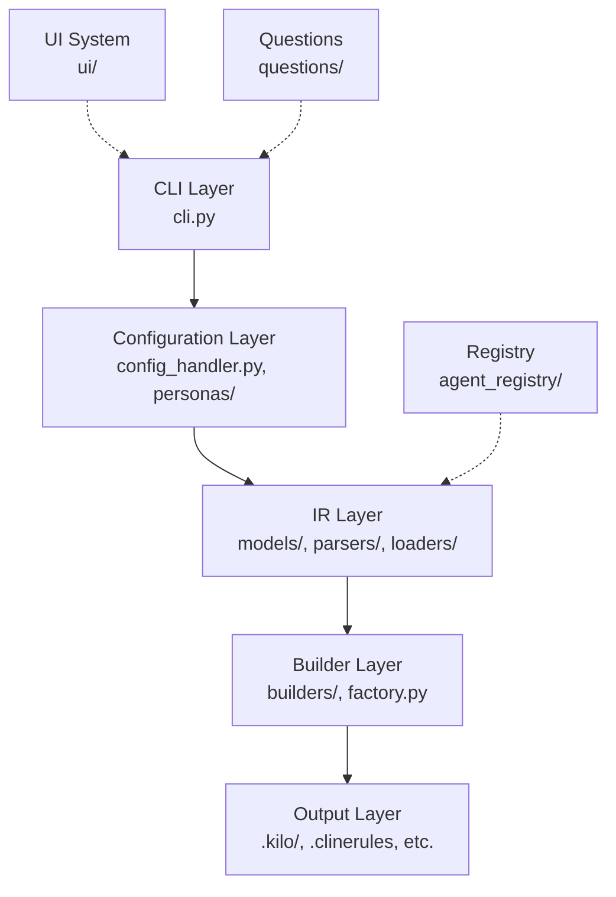
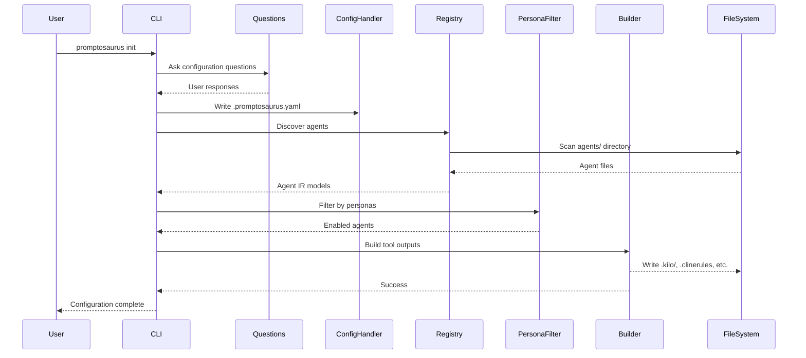
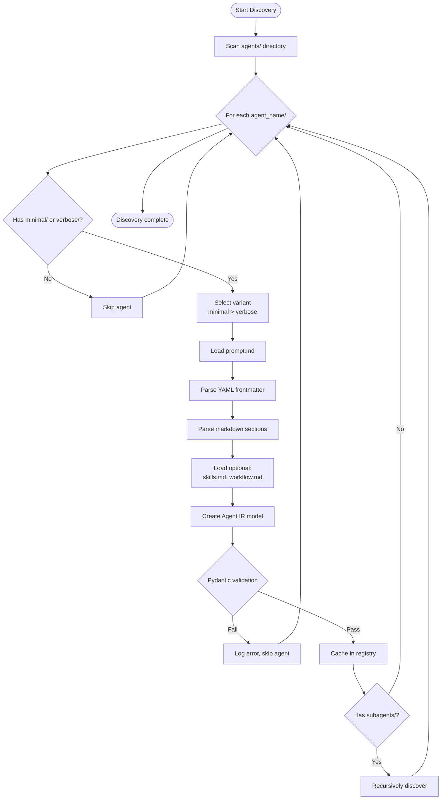
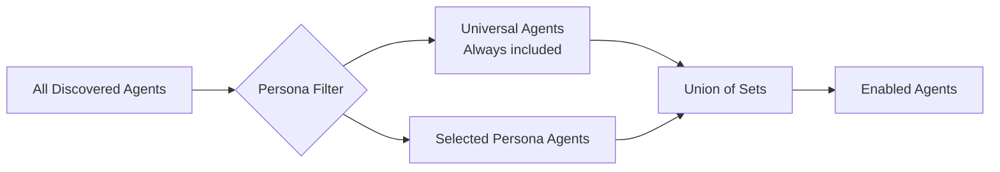

# Promptosaurus Architecture

Comprehensive architectural documentation for the promptosaurus system.

## Table of Contents

- [System Overview](#system-overview)
- [Architecture Layers](#architecture-layers)
- [Core Components](#core-components)
- [Data Flow](#data-flow)
- [Design Patterns](#design-patterns)
- [SOLID Principles](#solid-principles)
- [Extension Points](#extension-points)

---

## System Overview

### Purpose

Promptosaurus is a **tool-agnostic prompt architecture system** that enables you to:
- Define AI agents once in a unified Intermediate Representation (IR) format
- Generate configurations for 5 different AI coding assistants (Kilo, Cline, Claude, Cursor, Copilot)
- Manage agent complexity with minimal/verbose variants
- Filter agents by persona (role-based)
- Customize prompts with template substitution

### Design Goals

1. **Tool Agnostic:** Write once, deploy everywhere
2. **DRY Principle:** Single source of truth for agent definitions
3. **Composable:** Agents + Skills + Workflows
4. **Extensible:** Easy to add new builders, languages, personas
5. **Type Safe:** Leveraging Pydantic for validation
6. **Immutable:** IR models are frozen for safety

### System Boundaries

**In Scope:**
- Agent IR definition and parsing
- Builder implementations for 5 tools
- Configuration management
- Discovery and registry
- Template substitution

**Out of Scope:**
- Actual AI execution (handled by tools)
- Model selection/configuration
- Runtime agent behavior

---

## Architecture Layers



### Layer Responsibilities

| Layer | Responsibility | Key Files |
|-------|---------------|-----------|
| **CLI** | Command interface, user interaction | `cli.py` |
| **Configuration** | Config file management, personas | `config_handler.py`, `personas/registry.py` |
| **IR** | Agent models, parsing, loading | `ir/models/`, `ir/parsers/`, `ir/loaders/` |
| **Builder** | Tool-specific output generation | `builders/` |
| **Output** | Generated files for each tool | `.kilo/`, `.clinerules`, etc. |

---

## Core Components

### 1. IR (Intermediate Representation) System

**Location:** `promptosaurus/ir/`

#### Models (`ir/models/`)

Immutable Pydantic models representing agents:

```python
# agent.py
class Agent(BaseModel):
    model_config = ConfigDict(frozen=True)  # Immutable
    
    name: str
    description: str
    mode: str | None = None
    system_prompt: str
    tools: list[str] | None = None
    skills: list[Skill] | None = None
    workflows: list[Workflow] | None = None
    subagents: list[Agent] | None = None
    permissions: dict[str, Any] | None = None
```

**Key Models:**
- `Agent` - Main agent definition
- `Skill` - Reusable capability
- `Workflow` - Sequence of steps
- `Rules` - Constraints and guidelines
- `Tool` - Tool definition
- `Project` - Project metadata

**Benefits of Immutability:**
- Thread-safe
- Cacheable (hash remains constant)
- Predictable (no unexpected mutations)

#### Parsers (`ir/parsers/`)

Extract structured data from files:

- **YAMLParser** - Extract YAML frontmatter from markdown
- **MarkdownParser** - Extract sections by headers

```python
# Example: YAMLParser
content = """
---
name: architect
description: Design system architecture
---

# System Prompt
You are an architect...
"""

parser = YAMLParser()
result = parser.parse(content)
# result['metadata'] = {'name': 'architect', 'description': '...'}
# result['body'] = '# System Prompt\nYou are an architect...'
```

#### Loaders (`ir/loaders/`)

Load and construct IR models from filesystem:

- **ComponentLoader** - Load complete bundles (prompt + skills + workflow)
- **SkillLoader** - Load Skill models
- **WorkflowLoader** - Load Workflow models
- **CoreFilesLoader** - Load core system files
- **LanguageSkillMappingLoader** - Load language-specific mappings
- **AgentSkillMappingLoader** - Load agent-skill mappings

```python
# Example: ComponentLoader
loader = ComponentLoader("promptosaurus/agents/code/minimal")
bundle = loader.load()
# bundle.prompt - Prompt content
# bundle.skills - List of skills
# bundle.workflow - Workflow steps
```

### 2. Agent Registry & Discovery

**Location:** `promptosaurus/agent_registry/`

#### Discovery (`agent_registry/discovery.py`)

Auto-discovers agents from filesystem:

```python
discovery = RegistryDiscovery(agents_dir="promptosaurus/agents", variant="minimal")
agents = discovery.discover()
# Returns: {"code": Agent(...), "test": Agent(...), ...}
```

**Discovery Rules:**
1. Scan `agents/` directory
2. Look for `minimal/` or `verbose/` subdirectories
3. Require `prompt.md` in variant directory
4. Optional: `skills.md`, `workflow.md`
5. Recursively discover subagents in `subagents/` directory

**Directory Structure:**
```
agents/
├── code/
│   ├── minimal/
│   │   ├── prompt.md       # Required
│   │   ├── skills.md       # Optional
│   │   └── workflow.md     # Optional
│   └── verbose/
│       └── prompt.md
└── debug/
    ├── minimal/
    │   └── prompt.md
    └── subagents/           # Nested subagents
        ├── rubber-duck/
        │   └── minimal/
        │       └── prompt.md
        └── root-cause/
            └── minimal/
                └── prompt.md
```

#### Registry (`agent_registry/registry.py`)

Manages discovered agents with caching:

```python
registry = Registry.from_discovery("promptosaurus/agents", cache=True)
agent = registry.get_agent("code", variant="minimal")
all_agents = registry.get_all_agents()
names = registry.list_agents()
```

**Caching Strategy:**
- Variant indexing: Separate caches for minimal/verbose
- Lazy loading: Load only when requested
- Validation: Pydantic validates on load

### 3. Persona System

**Location:** `promptosaurus/personas/`

#### Purpose

Filter agents based on team roles (personas) to reduce cognitive load.

#### PersonaRegistry (`personas/registry.py`)

```python
registry = PersonaRegistry.from_yaml("promptosaurus/personas/personas.yaml")

# Get agents for a persona
agents = registry.get_agents_for_persona("software_engineer")
# Returns: ["code", "test", "refactor", "review", "document"]

# Get universal agents (always available)
universal = registry.get_universal_agents()
# Returns: ["ask", "debug", "explain", "plan", "orchestrator"]
```

#### PersonaFilter (`personas/registry.py`)

```python
filter = PersonaFilter(registry, selected_personas=["software_engineer", "qa_tester"])
enabled_agents = filter.get_enabled_agents()
# Returns union of agents from both personas + universal agents
```

**Persona Configuration:**
```yaml
version: "1.0"
universal_agents: [ask, debug, explain, plan, orchestrator]

personas:
  software_engineer:
    display_name: "Software Engineer"
    primary_agents: [code, test, refactor]
    secondary_agents: [review, document]
    workflows: [feature, bugfix]
    skills: [debugging-methodology, code-review-practices]
```

### 4. Builder System

**Location:** `promptosaurus/builders/`

#### Abstract Base Class (`builders/base.py`)

```python
class Builder:
    def build(self, agent: Agent, options: BuildOptions) -> str | dict:
        """Build tool-specific output from agent IR"""
        pass
    
    def validate(self, agent: Agent) -> list[str]:
        """Validate agent compatibility"""
        pass
```

#### Protocol-Based Interfaces (`builders/interfaces.py`)

Optional feature support via Protocols (PEP 544):

```python
class SupportsSkills(Protocol):
    def build_skills(self, skills: list[Skill]) -> str | dict:
        ...

class SupportsWorkflows(Protocol):
    def build_workflows(self, workflows: list[Workflow]) -> str | dict:
        ...
```

**Benefits:**
- Structural subtyping (duck typing with type checking)
- Optional features without multiple inheritance
- Builders implement only what they support

#### Builder Factory (`builders/factory.py`)

```python
factory = BuilderFactory()
factory.register("kilo", KiloBuilder)
factory.register("cline", ClineBuilder)

builder = factory.get_builder("kilo")
output = builder.build(agent, options)
```

**Registry Pattern:** Decouples builder creation from usage

#### Builder Implementations

| Builder | Output Format | File(s) Generated |
|---------|---------------|-------------------|
| **KiloBuilder** | YAML + Markdown | `.kilo/rules/*.md` |
| **ClineBuilder** | Markdown | `.clinerules` |
| **ClaudeBuilder** | JSON | `claude-agents.json` |
| **CursorBuilder** | Markdown | `.cursor/rules/*.mdc` |
| **CopilotBuilder** | Markdown | `.github/copilot-instructions.md` |

### 5. Template Substitution System

**Location:** `promptosaurus/builders/template_handlers/`

Dynamically substitute template variables based on project configuration.

#### Template Handlers

- **LanguageHandler** - `{{language}}` → `python`
- **RuntimeHandler** - `{{runtime}}` → `3.12`
- **PackageManagerHandler** - `{{package_manager}}` → `uv`
- **TestingFrameworkHandler** - `{{testing_framework}}` → `pytest`
- And 10+ more...

#### Jinja2 Integration (`resolvers/jinja2_template_renderer.py`)

```python
renderer = Jinja2TemplateRenderer()
template = "Language: {{language}}, Runtime: {{runtime}}"
config = {"language": "python", "runtime": "3.12"}
result = renderer.render(template, config)
# Result: "Language: python, Runtime: 3.12"
```

### 6. Configuration System

**Location:** `promptosaurus/config_handler.py`

#### ConfigHandler

Manages `.promptosaurus.yaml`:

```python
handler = ConfigHandler()
config = handler.read_config(".promptosaurus.yaml")

# Example config:
{
  "version": "1.0",
  "repository": {"type": "single-language"},
  "spec": {
    "language": "python",
    "runtime": "3.12",
    "package_manager": "uv"
  },
  "personas": ["software_engineer"]
}
```

### 7. UI System

**Location:** `promptosaurus/ui/`

Terminal-based interactive UI for configuration.

**Components:**
- **Input Providers** (`ui/input/`) - curses, Unix, Windows, fallback
- **Commands** (`ui/commands/`) - Navigate, Select, Confirm, Quit
- **Render** (`ui/render/`) - Vertical, Columns, Explain
- **State** (`ui/state/`) - Selection state management
- **Pipeline** (`ui/pipeline/`) - Orchestration

### 8. Questions System

**Location:** `promptosaurus/questions/`

Interactive interrogation for project configuration.

**Language-Specific Questions:**
- Python: runtime, package manager, coverage targets, abstract class style
- TypeScript: version, package manager

**Handlers:**
- `HandleSingleLanguageQuestions`
- Spec handlers for single/multi-language repos

---

## Data Flow

### Build Flow (init command)



### Discovery Flow



### Persona Filtering Flow



---

## Design Patterns

### 1. Factory Pattern

**BuilderFactory** creates builder instances:

```python
# Registration
factory.register("kilo", KiloBuilder)

# Creation
builder = factory.get_builder("kilo")
```

**Benefits:**
- Decouples creation from usage
- Easy to add new builders
- Centralized builder management

### 2. Builder Base Class

**Builder** defines interface:

```python
class Builder:
    def build(self, agent: Agent, options: BuildOptions) -> str | dict:
        pass
```

**Benefits:**
- Enforces interface contract
- Type safety
- Clear extension points

### 3. Protocol Pattern (PEP 544)

Optional features via structural subtyping:

```python
class SupportsSkills(Protocol):
    def build_skills(self, skills: list[Skill]) -> str | dict: ...
```

**Benefits:**
- No multiple inheritance
- Duck typing with type checking
- Optional feature implementation

### 4. Registry Pattern

Multiple registries throughout:
- `Registry` - Discovered agents
- `PersonaRegistry` - Persona definitions
- `BuilderFactory._builders` - Registered builders
- `ConfigOptionsRegistry` - Configuration options

**Benefits:**
- Centralized management
- Discovery/lookup separation
- Caching

### 5. Template Method

Builders follow template:
1. Validate agent
2. Build sections (system prompt, skills, workflows)
3. Compose output
4. Format for tool

### 6. Composite

Agent hierarchy:
- Agent contains Subagents
- Agent contains Skills
- Agent contains Workflows

**Benefits:**
- Recursive structure
- Uniform interface
- Easy nesting

### 7. Strategy

Different builders = different strategies for same goal:
- KiloBuilder strategy: YAML + Markdown
- ClaudeBuilder strategy: JSON
- ClineBuilder strategy: Plain Markdown

---

## SOLID Principles

### Single Responsibility Principle (SRP)

Each class has one reason to change:
- `YAMLParser` - Only parses YAML
- `ConfigHandler` - Only manages config files
- `PersonaFilter` - Only filters agents

### Open/Closed Principle (OCP)

**Open for extension, closed for modification:**
- Add new builders without changing `BuilderFactory`
- Add new personas without changing `PersonaFilter`
- Add new template handlers without changing renderer

### Liskov Substitution Principle (LSP)

All builders substitute `Builder`:
```python
def process(builder: Builder):
    result = builder.build(agent, options)  # Works for any builder
```

### Interface Segregation Principle (ISP)

Protocols allow optional features:
- Builders implement only `SupportsSkills` if they support skills
- No forced implementation of unused features

### Dependency Inversion Principle (DIP)

Depend on abstractions:
- `PromptBuilder` depends on `Builder` (not concrete builders)
- Factory returns abstractions, not concrete types

---

## Extension Points

### Adding a New Builder

1. **Create builder class:**
```python
class MyToolBuilder(Builder):
    def build(self, agent: Agent, options: BuildOptions) -> str:
        # Implementation
        pass
    
    def validate(self, agent: Agent) -> list[str]:
        # Validation
        pass
```

2. **Register with factory:**
```python
BuilderFactory().register("mytool", MyToolBuilder)
```

3. **Add to CLI:**
```python
# In cli.py, add "mytool" to supported tools
```

### Adding a New Language

1. **Create language questions:**
```python
# In questions/mylang/
class MyLangRuntimeQuestion: ...
class MyLangPackageManagerQuestion: ...
```

2. **Add language support:**
```python
# In questions/language.py
LanguageRegistry.register("mylang", MyLangQuestions)
```

3. **Create conventions file:**
```
promptosaurus/configurations/core/core-conventions-mylang.md
```

### Adding a New Persona

1. **Edit personas.yaml:**
```yaml
personas:
  my_persona:
    display_name: "My Persona"
    primary_agents: [agent1, agent2]
    workflows: [workflow1]
    skills: [skill1]
```

2. **Update persona registry** (auto-loads from YAML)

### Adding a New Template Handler

1. **Create handler:**
```python
class MyTemplateHandler:
    def handle(self, config: dict) -> str:
        return config.get("my_field", "default")
```

2. **Register handler:**
```python
# In template system
register_handler("my_field", MyTemplateHandler)
```

---

## Performance Considerations

### Caching

- **Registry caching:** Variant-specific caches
- **Template caching:** `TemplateCache` for Jinja2 templates
- **Discovery caching:** Optional cache in `Registry.from_discovery(cache=True)`

### Lazy Loading

- Agents loaded only when requested
- Files read on-demand
- Models constructed just-in-time

### Immutability Benefits

- Safe to cache (no mutations)
- Thread-safe (no race conditions)
- Predictable hashing

---

## Security Considerations

### YAML Safety

- Use `yaml.safe_load()` (not `yaml.load()`)
- Validate schema with Pydantic

### File System Access

- Validate paths before reading/writing
- No arbitrary file execution
- Sandboxed to project directory

### Template Injection

- Jinja2 sandboxed environment
- No arbitrary code execution in templates
- Validated template variables

---

## Testing Strategy

- **Unit Tests:** `tests/unit/` - Individual components
- **Integration Tests:** `tests/integration/` - End-to-end flows
- **Security Tests:** `tests/security/` - Security validations
- **Slow Tests:** `tests/slow/` - Performance tests

**Coverage:** Aim for 90%+ in critical paths

---

## References

- [BUILDER_IMPLEMENTATION_GUIDE.md](./builders/BUILDER_IMPLEMENTATION_GUIDE.builder.md) - Implementing builders
- [API_REFERENCE.reference.md](./reference/API_REFERENCE.reference.md) - Complete API reference
- [PERSONAS.md](./PERSONAS.md) - Persona system details
- [GETTING_STARTED.md](./user-guide/GETTING_STARTED.md) - User guide

---

**Last Updated:** 2026-04-13  
**Version:** 0.1.0
