# Visual Diagrams & Flows

Comprehensive visual documentation for Promptosaurus workflows using Mermaid diagrams.

## Table of Contents

- [Workflow Diagrams](#workflow-diagrams)
- [CLI Interaction Flows](#cli-interaction-flows)
- [Data Flow Diagrams](#data-flow-diagrams)
- [Configuration Flow](#configuration-flow)
- [Agent Discovery Flow](#agent-discovery-flow)
- [Builder Selection Flow](#builder-selection-flow)

---

## Workflow Diagrams

### Complete Promptosaurus Setup Workflow

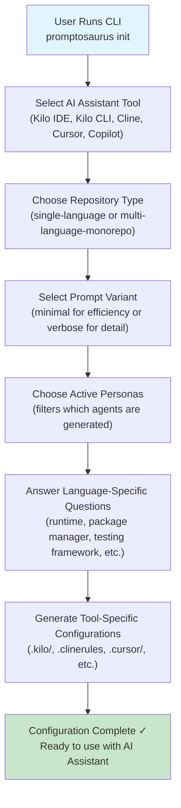

---

## CLI Interaction Flows

### Init Command Flow

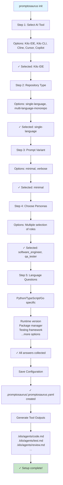

### Switch Command Flow

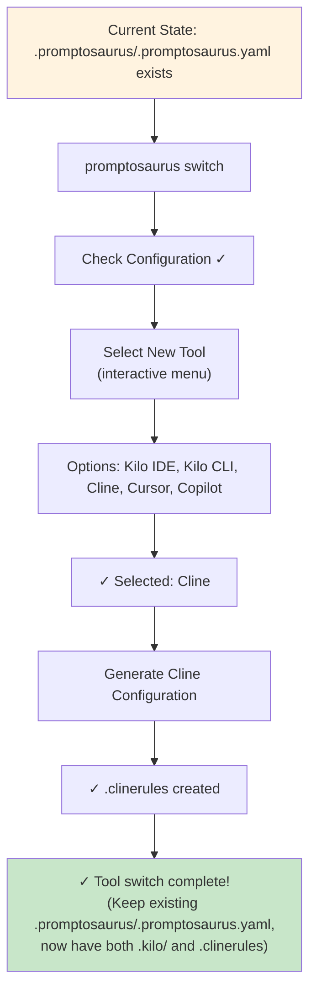

### Swap Command Flow

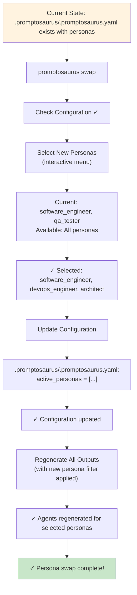

---

## Data Flow Diagrams

### Agent Discovery and Build Flow

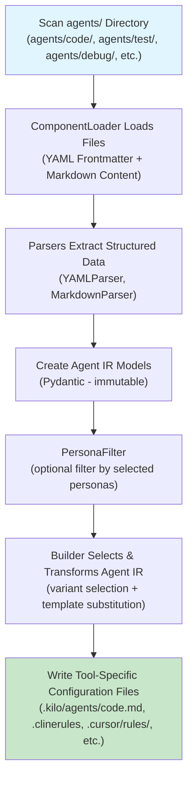

### Template Substitution Flow

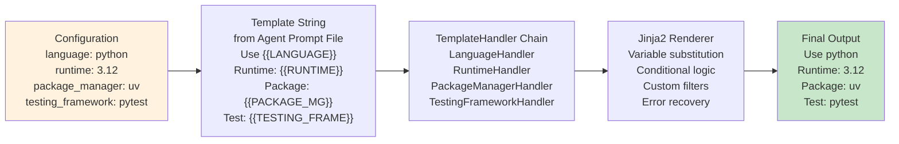

---

## Configuration Flow

### Single-Language Setup

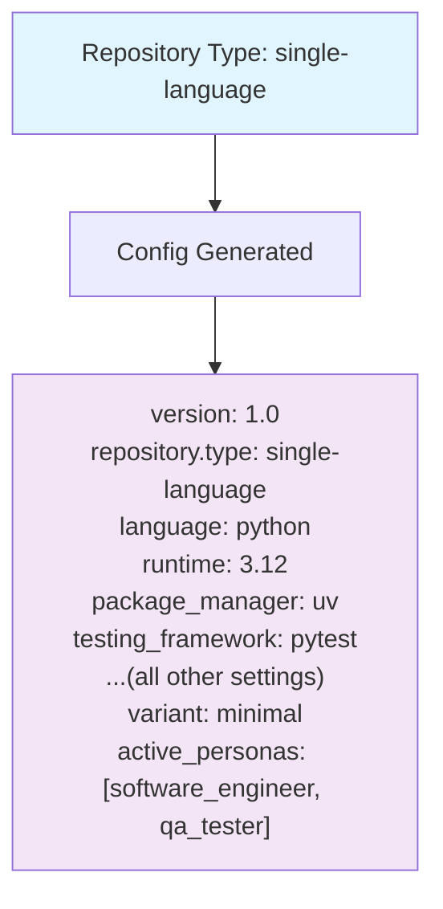

### Multi-Language Monorepo Setup

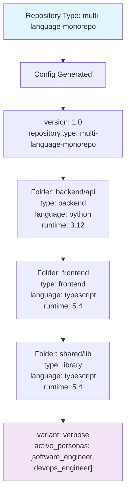

---

## Agent Discovery Flow

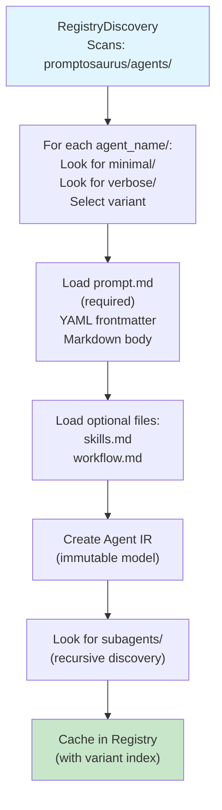

---

## Builder Selection Flow

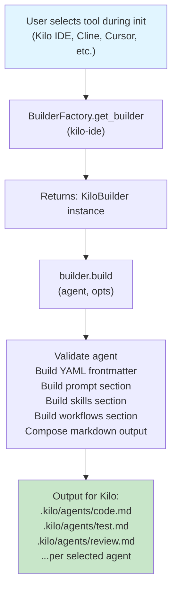

---

## Tool Output Locations

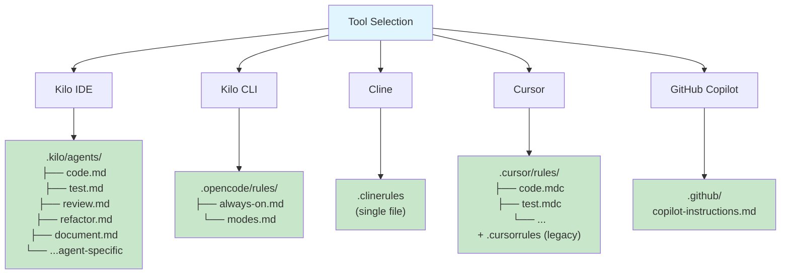

---

## Reference

- [ARCHITECTURE.md](./ARCHITECTURE.md) - Detailed component documentation
- [GETTING_STARTED.md](./user-guide/GETTING_STARTED.md) - Step-by-step guide
- [ADVANCED_CONFIGURATION.md](./ADVANCED_CONFIGURATION.md) - Configuration reference
