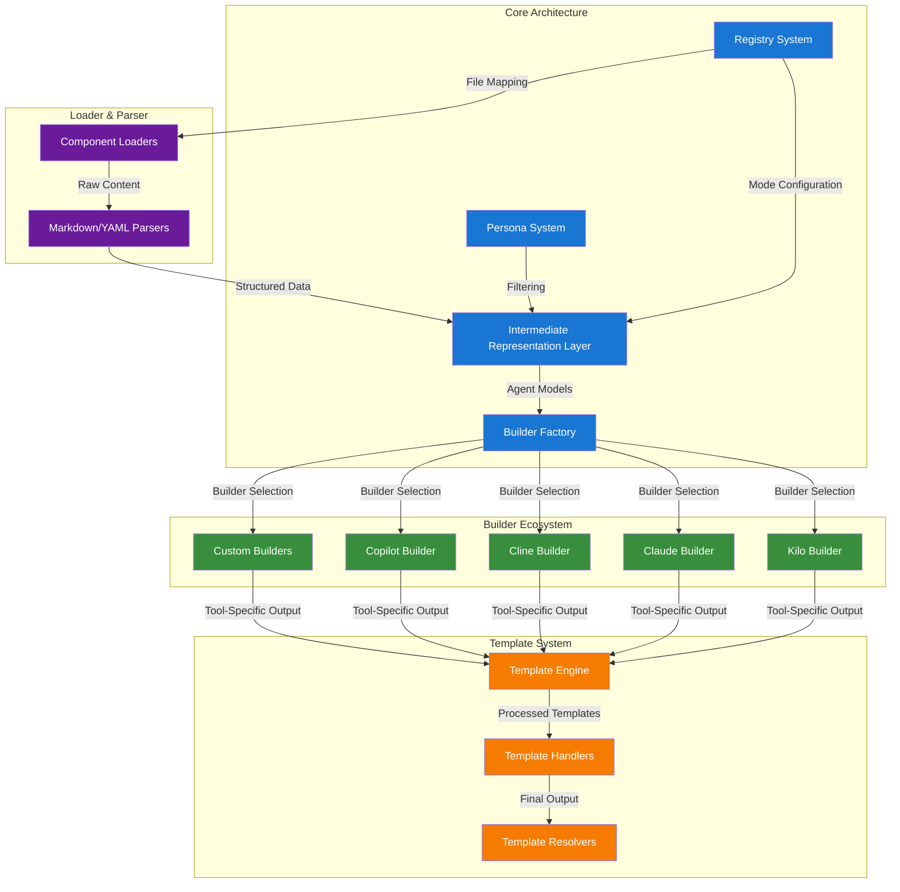
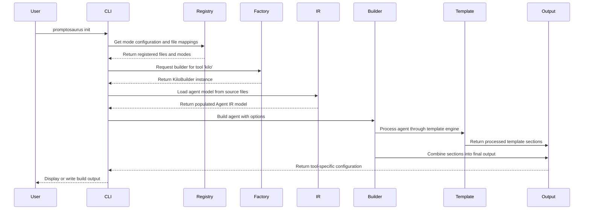

# Promptosaurus Architecture Overview

## System Architecture Diagram

## Component Responsibilities

### 1. Intermediate Representation (IR) Layer
**Location:** `promptosaurus/ir/`
**Purpose:** Provides tool-agnostic data models for all prompt architecture components
**Components:**
- **Agent Model:** Represents AI agent configuration with tools, skills, workflows
- **Skill Model:** Encapsulates specialized knowledge domains
- **Workflow Model:** Defines sequential task execution steps
- **Tool Model:** Describes available tool integrations
- **Rules Model:** Configures behavioral constraints and guidelines
- **Project Model:** Manages project-level configuration

### 2. Builder Architecture
**Location:** `promptosaurus/builders/`
**Purpose:** Transforms IR models into tool-specific output formats
**Components:**
- **Builder:** Base class defining builder interface
- **BuilderFactory:** Registry and instantiation mechanism for builders
- **Tool-Specific Builders:** KiloBuilder, ClaudeBuilder, ClineBuilder, CopilotBuilder
- **Template Handlers:** Process different template sections (skills, workflows, etc.)
- **BuildOptions:** Configuration for build variants (minimal/verbose)

### 3. Registry System
**Location:** `promptosaurus/registry.py`
**Purpose:** Central configuration for modes, files, and output ordering
**Components:**
- **Mode Registry:** Maps mode keys to display names and file lists
- **Always-on Files:** Core files loaded for all modes
- **Concatenation Order:** Defines output section ordering
- **Ignore Pattern Generation:** Creates tool-specific ignore files
- **Validation:** Ensures all registered files exist

### 4. Persona Filtering System
**Location:** `promptosaurus/personas/`
**Purpose:** Enables role-based agent, workflow, and skill selection
**Components:**
- **PersonaRegistry:** Loads and manages persona definitions from YAML
- **PersonaFilter:** Implements dynamic enabling/disabling algorithm
- **Universal Agents:** Always-enabled agents available to all personas

### 5. Template Substitution System
**Location:** `promptosaurus/builders/template_handlers/`
**Purpose:** Processes Jinja2 templates with custom filters and resolvers
**Components:**
- **Template Engine:** Jinja2-based rendering engine
- **Template Handlers:** Process specific sections (skills, workflows, tools)
- **Custom Filters:** Extend Jinja2 with project-specific functionality
- **Template Loaders:** Load templates from various sources
- **Error Resolvers:** Handle template rendering errors gracefully

### 6. Loader and Parser Architecture
**Location:** `promptosaurus/ir/loaders/` and `promptosaurus/ir/parsers/`
**Purpose:** Loads and parses prompt source files into IR models
**Components:**
- **Component Loaders:** Load agents, skills, workflows, tools, rules
- **Mapping Loaders:** Load agent-skill, agent-workflow, language-skill mappings
- **Core Files Loader:** Loads always-on configuration files
- **Markdown Parser:** Parses markdown frontmatter and content
- **YAML Parser:** Parses YAML configuration files
- **Language Skill Mapping Loader:** Maps skills to programming languages

## Data Flow

## Key Design Decisions

### 1. Tool-Agnostic IR Layer
**Decision:** Create a pure Python data model layer independent of any specific AI tool
**Rationale:** Enables reuse across different tools and frameworks without duplication
**Impact:** Builders can focus solely on tool-specific translation logic

### 2. Factory Pattern for Builders
**Decision:** Use BuilderFactory with registration-based builder discovery
**Rationale:** Allows dynamic builder registration and easy extension
**Impact:** Third-party builders can be added without modifying core code

### 3. Protocol-Based Feature Support
**Decision:** Use typing.Protocol for optional builder features instead of inheritance
**Rationale:** Provides structural subtyping without runtime overhead or tight coupling
**Impact:** Builders only implement features they support, enabling flexible combinations

### 4. Hierarchical Agent Composition
**Decision:** Allow agents to contain subagents for compositional complexity
**Rationale:** Supports both simple agents and complex agent hierarchies
**Impact:** Enables modeling of sophisticated AI systems with delegated responsibilities

### 5. Jinja2 Template Engine with Custom Resolvers
**Decision:** Use Jinja2 as template engine with custom error handling and filters
**Rationale:** Mature, flexible templating with sandboxed execution
**Impact:** Powerful template processing with graceful error recovery

### 6. YAML-Based Persona Definitions
**Decision:** Store persona configurations in YAML for human readability
**Rationale:** YAML is widely understood and supports complex data structures
**Impact:** Easy to define, modify, and extend persona configurations

### 7. Immutable IR Models with Pydantic
**Decision:** Use Pydantic BaseModel with frozen=True for IR models
**Rationale:** Ensures data integrity and provides automatic validation
**Impact:** Prevents accidental modification and provides clear error messages

### 8. Separation of Concerns in Build Process
**Decision:** Separate validation, building, and template processing into distinct phases
**Rationale:** Makes each phase testable and replaceable independently
**Impact:** Enables custom validation rules and alternative template engines

## Architectural Benefits

1. **Extensibility:** New tools, builders, and features can be added without modifying core
2. **Maintainability:** Clear separation of concerns makes the codebase easier to understand
3. **Reusability:** IR models can be reused across different tools and contexts
4. **Type Safety:** Extensive use of type hints and Pydantic validation catches errors early
5. **Performance:** Caching and lazy loading optimize repeated operations
6. **Flexibility:** Protocol-based design allows mix-and-match feature support
