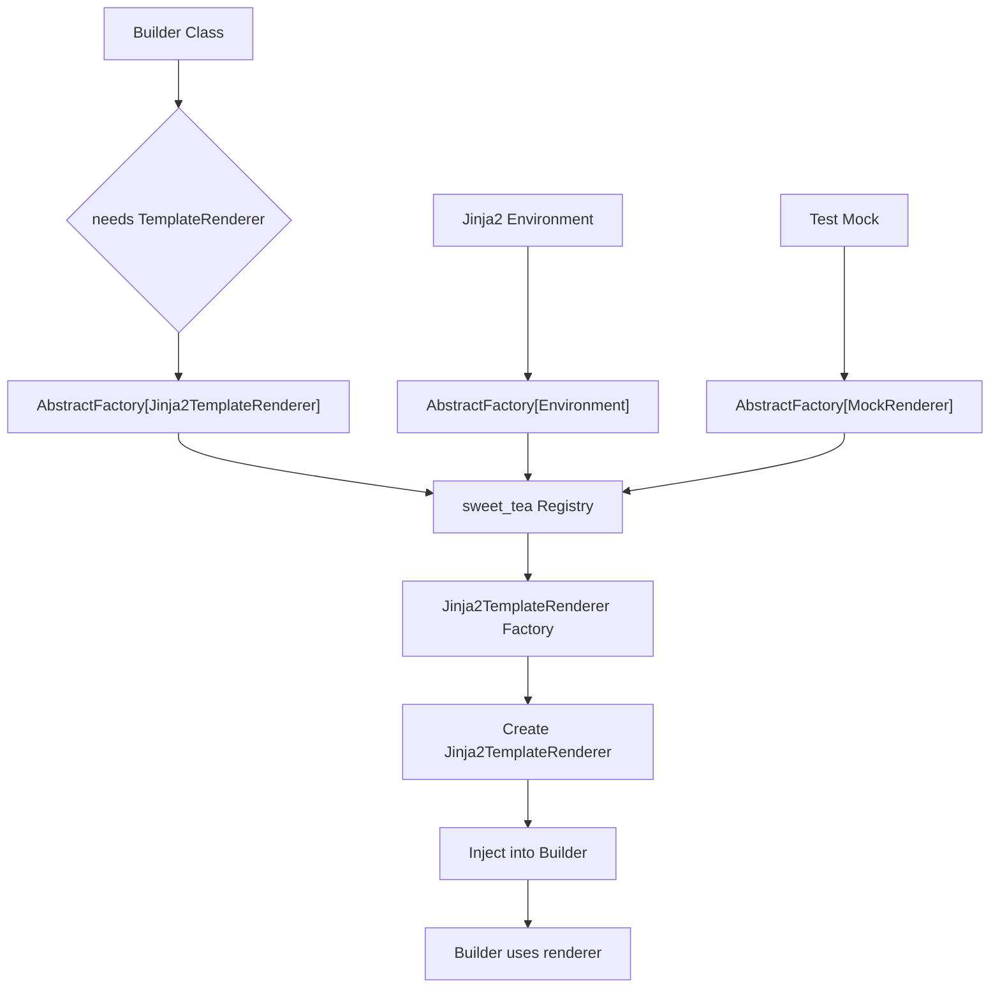

# ARD: Dependency Injection Design with sweet_tea

## Context

The Jinja2 template rendering system needs to be designed as an injected OOP dependency rather than a direct import, following the user's requirement for proper dependency injection patterns. The existing codebase already uses sweet_tea extensively for factory patterns, and we need to integrate the new Jinja2 functionality using this established pattern.

Key requirements:
- Jinja2 functionality as injected dependency
- Use sweet_tea factory system (AbstractFactory, AbstractInverterFactory, Registry)
- No creation of additional registries (sweet_tea has built-in factory abstraction)
- Maintain existing template_handlers interface compatibility

## Decision

Implement Jinja2 template rendering as an injected dependency using sweet_tea's factory pattern, creating both Jinja2 Environment instances and TemplateRenderer wrapper objects through the factory system.

### Architecture Overview

1. **Jinja2TemplateRenderer Class:**
   - Wraps Jinja2 Environment and Template objects
   - Implements existing TemplateVariableHandler protocol
   - Handles Jinja2-specific error conversion via the established exception hierarchy

2. **Factory Integration:**
   - Use sweet_tea's `AbstractFactory[Jinja2TemplateRenderer]` for creating renderer instances
   - Registration and resolution handled by sweet_tea's built-in factory abstraction
   - Support both Environment and TemplateRenderer creation

3. **Dependency Injection:**
   - TemplateRenderer injected into Builder classes via sweet_tea's `AbstractFactory`
   - Factory used for creating renderer instances on demand

### Implementation Details

#### Jinja2TemplateRenderer Class

```python
class Jinja2TemplateRenderer:
    def __init__(self, environment: jinja2.Environment):
        self.environment = environment
        self._template_cache: dict[str, jinja2.Template] = {}

    def can_handle(self, variable_name: str) -> bool:
        return True  # Handles all template variables with Jinja2

    def handle(self, template_source: str, context: dict[str, Any],
               template_name: str | None = None) -> str:
        template_name = template_name or "<inline>"

        if template_name not in self._template_cache:
            try:
                self._template_cache[template_name] = self.environment.from_string(template_source)
            except jinja2.TemplateSyntaxError as e:
                raise TemplateSyntaxError(
                    f"Jinja2 syntax error in template '{template_name}': {e.message}",
                    template_name=template_name,
                    line_number=e.lineno,
                    column=getattr(e, 'pos', None)
                ) from e
            except jinja2.TemplateError as e:
                raise TemplateError(
                    f"Template compilation failed for '{template_name}': {e}",
                    template_name=template_name
                ) from e

        template = self._template_cache[template_name]

        try:
            return template.render(**context)
        except jinja2.UndefinedError as e:
            raise TemplateRenderingError(
                f"Undefined variable in template '{template_name}': {e.message}",
                template_name=template_name,
                context_keys=list(context.keys())
            ) from e
        except jinja2.TemplateRuntimeError as e:
            raise TemplateRenderingError(
                f"Template execution failed for '{template_name}': {e}",
                template_name=template_name,
                context_keys=list(context.keys())
            ) from e
        except Exception as e:
            # Intentionally broad: catches unexpected Jinja2 internals or
            # third-party filter errors that don't subclass TemplateRuntimeError.
            # Context values are intentionally excluded to prevent sensitive data leaks.
            raise TemplateRenderingError(
                f"Unexpected error rendering template '{template_name}': {type(e).__name__}",
                template_name=template_name,
                context_keys=list(context.keys())
            ) from e
```

#### Factory Integration

sweet_tea is an installed dependency that provides `AbstractFactory`, `AbstractInverterFactory`, and `Registry` out of the box. No manual factory registration or custom registry is required — sweet_tea's built-in factory abstraction handles component creation and resolution automatically. Refer to the sweet_tea documentation for configuration details.

#### Dependency Injection in Builder

```python
class Builder:
    def __init__(self, template_renderer_factory: AbstractFactory[Jinja2TemplateRenderer]):
        self.template_renderer_factory = template_renderer_factory

    def _substitute_template_variables(self, content: str, context: dict[str, Any],
                                        template_name: str | None = None) -> str:
        renderer = self.template_renderer_factory.create()
        return renderer.handle(content, context, template_name)
```

## Status

Proposed

## Consequences

### Positive
- **Proper Dependency Injection:** Follows established patterns for testability and flexibility
- **Consistency:** Aligns with existing sweet_tea usage throughout codebase
- **Testability:** Easy to mock and test with different renderer implementations
- **Extensibility:** Factory pattern allows for easy addition of new renderer types
- **Configuration Management:** Registry-based configuration follows existing patterns

### Negative
- **Additional Complexity:** Factory abstraction adds indirection
- **Learning Curve:** Understanding sweet_tea factory patterns required
- **Runtime Overhead:** Factory lookups add small performance cost
- **Configuration Complexity:** Registry configuration must be managed

### Neutral
- **API Compatibility:** Maintains existing TemplateVariableHandler interface
- **Full Replacement:** All existing handlers are replaced; no gradual migration path
- **Performance Impact:** Minimal for typical use cases

## Alternatives Considered

### Alternative 1: Direct Jinja2 Import and Usage
**Pros:**
- Simplest implementation
- No factory abstraction overhead
- Direct control over Jinja2 features

**Cons:**
- Violates dependency injection requirement
- Hard to test and mock
- Inconsistent with existing patterns
- Tight coupling to Jinja2

**Decision:** Rejected - violates user requirement for injected OOP dependency

### Alternative 2: Custom Factory Implementation
**Pros:**
- Full control over factory behavior
- Tailored to specific needs
- No external dependency on sweet_tea patterns

**Cons:**
- Reimplementation of existing patterns
- Maintenance burden
- Inconsistency with codebase
- Potential for bugs

**Decision:** Rejected - should leverage existing sweet_tea infrastructure

### Alternative 3: Service Locator Pattern
**Pros:**
- Simple global access to renderers
- Less complex than full factory
- Easy to implement

**Cons:**
- Global state management issues
- Harder to test
- Violates dependency injection principles
- Less flexible than factory pattern

**Decision:** Rejected - factory pattern better aligns with existing sweet_tea usage

### Alternative 4: Constructor Injection Only
**Pros:**
- Simpler than factory pattern
- Direct dependency injection
- Easy to understand

**Cons:**
- Requires manual instantiation everywhere
- No centralized configuration
- Harder to change implementations
- Doesn't leverage sweet_tea's AbstractFactory and Registry

**Decision:** Rejected - sweet_tea's AbstractFactory provides better configuration management and follows established patterns

## Related Documents

- PRD: [PRD_JINJA2_TEMPLATES.md](../prd/PRD_JINJA2_TEMPLATES.md)
- ARD: [ARD_JINJA2_ENGINE_SELECTION.md](ARD_JINJA2_ENGINE_SELECTION.md)
- ARD: [ARD_TEMPLATE_HANDLER_INTEGRATION.md](ARD_TEMPLATE_HANDLER_INTEGRATION.md)

---


