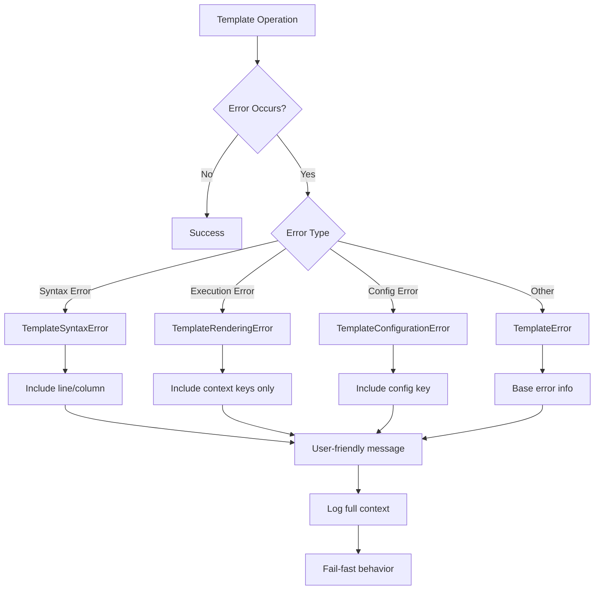

# ARD: Error Handling Strategy

## Context

The Jinja2 template system introduces new error handling requirements compared to the existing simple string replacement system. The user has specified that Jinja2 should raise exceptions on syntax errors, but we need to design a comprehensive error handling strategy that covers:

- Jinja2 syntax errors and template compilation failures
- Runtime template execution errors
- Integration with existing error handling patterns
- User-friendly error messages with context
- Fail-fast behavior for template validation

The existing codebase follows Python exception hierarchies and Result pattern conventions, and the new error handling must align with these patterns.

## Decision

Implement a comprehensive error handling strategy for Jinja2 templates that includes custom exception types, clear error messages, and integration with existing error handling patterns.

### Error Handling Architecture

1. **Custom Exception Hierarchy:**
   - `TemplateError`: Base exception for all template-related errors
   - `TemplateSyntaxError`: For Jinja2 syntax errors
   - `TemplateRenderingError`: For runtime template execution errors
   - `TemplateConfigurationError`: For configuration-related errors

2. **Error Context and Messages:**
   - Include template name/location in error messages
   - Provide line numbers and character positions where possible
   - Include original Jinja2 error details
   - Suggest common fixes for typical errors

3. **Fail-Fast Validation:**
   - Validate templates at creation/load time
   - Cache validation results to avoid repeated checks
   - Provide validation utilities for CI/CD pipelines

### Implementation Details

#### Exception Hierarchy

```python
class TemplateError(Exception):
    """Base exception for template-related errors."""

    def __init__(self, message: str, template_name: str | None = None):
        super().__init__(message)
        self.template_name = template_name

class TemplateSyntaxError(TemplateError):
    """Raised when Jinja2 template has syntax errors."""

    def __init__(self, message: str, template_name: str | None = None,
                 line_number: int | None = None, column: int | None = None):
        super().__init__(message, template_name)
        self.line_number = line_number
        self.column = column

class TemplateRenderingError(TemplateError):
    """Raised when template execution fails at runtime."""

    def __init__(self, message: str, template_name: str | None = None,
                 context_keys: list[str] | None = None):
        super().__init__(message, template_name)
        self.context_keys = context_keys or []

class TemplateConfigurationError(TemplateError):
    """Raised when template configuration is invalid."""

    def __init__(self, message: str, config_key: str | None = None):
        super().__init__(message)
        self.config_key = config_key
```

#### Error Handling in Template Renderer

```python
class Jinja2TemplateRenderer:
    def __init__(self, environment: jinja2.Environment):
        self.environment = environment
        self._template_cache: dict[str, jinja2.Template] = {}

    def _compile_template(self, template_source: str, template_name: str) -> jinja2.Template:
        """Compile template with error handling."""
        try:
            return self.environment.from_string(template_source)
        except jinja2.TemplateSyntaxError as e:
            raise TemplateSyntaxError(
                f"Jinja2 syntax error in template '{template_name}': {e.message}",
                template_name=template_name,
                line_number=e.lineno,
                column=getattr(e, 'pos', None)
            ) from e
        except jinja2.TemplateError as e:
            raise TemplateError(
                f"Template compilation failed for '{template_name}': {e}",
                template_name=template_name
            ) from e

    def render(self, template_source: str, context: dict[str, Any],
               template_name: str | None = None) -> str:
        """Render template with comprehensive error handling."""
        template_name = template_name or "<inline>"

        # Compile template (with caching by template name)
        if template_name not in self._template_cache:
            self._template_cache[template_name] = self._compile_template(
                template_source, template_name
            )

        template = self._template_cache[template_name]

        # Execute template
        try:
            return template.render(**context)
        except jinja2.UndefinedError as e:
            raise TemplateRenderingError(
                f"Undefined variable in template '{template_name}': {e.message}",
                template_name=template_name,
                context_keys=list(context.keys())
            ) from e
        except jinja2.TemplateRuntimeError as e:
            raise TemplateRenderingError(
                f"Template execution failed for '{template_name}': {e}",
                template_name=template_name,
                context_keys=list(context.keys())
            ) from e
        except Exception as e:
            # Intentionally broad: catches unexpected Jinja2 internals or
            # third-party filter errors that don't subclass TemplateRuntimeError.
            # Context values are intentionally excluded to prevent sensitive data leaks.
            raise TemplateRenderingError(
                f"Unexpected error rendering template '{template_name}': {type(e).__name__}",
                template_name=template_name,
                context_keys=list(context.keys())
            ) from e
```

## Status

Proposed

## Consequences

### Positive
- **Clear Error Messages:** Detailed error information helps developers debug template issues
- **Fail-Fast Behavior:** Catches template errors early in the process
- **Type Safety:** Custom exceptions provide better type narrowing than generic exceptions
- **Debugging Support:** Context keys and line numbers aid troubleshooting without exposing sensitive values
- **Consistency:** Aligns with existing error handling patterns in the codebase

### Negative
- **Performance Overhead:** Exception creation and context capture adds overhead
- **Error Translation:** Converting Jinja2 exceptions to custom types adds complexity
- **Learning Curve:** Teams need to understand new exception types
- **Reduced Debug Context:** Storing only context keys rather than values limits visibility into runtime state

### Neutral
- **Backwards Compatibility:** Existing string replacement doesn't use these exceptions
- **Logging Integration:** Errors can be easily logged with full context
- **Testing:** Exception types make testing error conditions easier

## Alternatives Considered

### Alternative 1: Use Jinja2 Exceptions Directly
**Pros:**
- No wrapper exceptions needed
- Direct access to Jinja2 error details
- Less code to maintain

**Cons:**
- Inconsistent with codebase error handling patterns
- Harder to catch template-specific errors
- Jinja2 exceptions may change between versions
- Less user-friendly error messages

**Decision:** Rejected - violates consistency and user experience requirements

### Alternative 2: Result Pattern Instead of Exceptions
**Pros:**
- Functional programming style
- Explicit error handling
- No exception overhead

**Cons:**
- Inconsistent with existing codebase patterns
- More verbose error handling code
- Harder to integrate with existing exception-based code
- Not fail-fast as requested

**Decision:** Rejected - user specified exception-based error handling

### Alternative 3: Simple Exception Wrapping
**Pros:**
- Minimal code changes
- Direct mapping to Jinja2 errors
- Easy to implement

**Cons:**
- Less context in error messages
- No line number information
- Harder to debug complex templates
- Missing configuration error handling

**Decision:** Rejected - insufficient error context for debugging

### Alternative 4: Global Error Handler
**Pros:**
- Centralized error handling
- Consistent error formatting
- Easy to modify error behavior

**Cons:**
- Global state management issues
- Harder to test specific error conditions
- Less flexible for different use cases
- Can hide errors if not configured properly

**Decision:** Rejected - too much global state and less testable

## Related Documents

- PRD: [PRD_JINJA2_TEMPLATES.md](../prd/PRD_JINJA2_TEMPLATES.md)
- ARD: [ARD_JINJA2_ENGINE_SELECTION.md](ARD_JINJA2_ENGINE_SELECTION.md)
- ARD: [ARD_DEPENDENCY_INJECTION_DESIGN.md](ARD_DEPENDENCY_INJECTION_DESIGN.md)
- ARD: [ARD_TEMPLATE_HANDLER_INTEGRATION.md](ARD_TEMPLATE_HANDLER_INTEGRATION.md)

---


