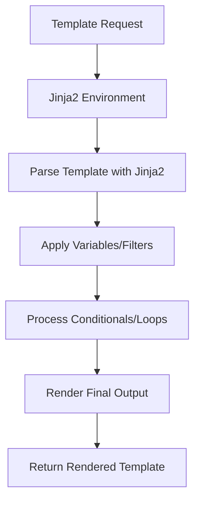

# ARD: Jinja2 Engine Selection

## Context

The current template system uses simple string replacement with `{{VARIABLE}}` patterns, which limits the expressiveness and maintainability of templates. The builder system needs to support more advanced templating features like conditionals, loops, macros, and filters to generate more complex and dynamic configuration files.

We need to migrate from basic string substitution to a proper templating engine while maintaining compatibility with existing template variable patterns and integrating with the existing sweet_tea factory system for dependency injection.

## Decision

Adopt Jinja2 as the templating engine for the template rendering system.

### Implementation Details

1. **Core Features to Support:**
   - Variables: `{{variable_name}}`
   - Filters: `{{variable_name | filter}}`
   - Conditionals: `...`
   - Loops: `...`
   - Set statements: ``
   - Macros: `...`
   - Includes: ``

2. **Template Variable Data Structure:**
   - Use existing YAML/dict configuration format
   - Support nested dictionaries and lists
   - Maintain backwards compatibility with current `{{VARIABLE}}` patterns

3. **Error Handling:**
   - Raise exceptions on Jinja2 syntax errors
   - Provide clear error messages with template location
   - Fail fast on invalid templates

## Status

Proposed

## Consequences

### Positive
- **Enhanced Expressiveness:** Support for conditionals, loops, macros, and filters enables more sophisticated template logic
- **Standardization:** Jinja2 is a mature, widely-used templating engine with extensive documentation and community support
- **Performance:** Compiled templates with caching capabilities for better performance
- **Security Features:** Built-in sandboxing capabilities for safe template execution
- **Maintainability:** More readable and maintainable templates with advanced features

### Negative
- **Dependency Addition:** Introduces Jinja2 as a new dependency
- **Learning Curve:** Team needs to learn Jinja2 syntax and features
- **Complexity:** More complex template system increases potential for errors
- **Performance Overhead:** Initial template compilation and caching adds some overhead

### Neutral
- **File Size Impact:** Templates may become slightly larger with more advanced syntax
- **Debugging:** Different error messages and debugging approaches compared to simple string replacement

## Alternatives Considered

### Alternative 1: Extend Current String Replacement System
**Pros:**
- No new dependencies
- Minimal changes to existing code
- Fastest possible implementation
- Zero learning curve

**Cons:**
- Limited expressiveness (no conditionals, loops, macros)
- Difficult to maintain complex templates
- No built-in error handling
- Hard to extend for advanced use cases

**Decision:** Rejected - doesn't meet requirements for advanced templating features

### Alternative 2: Use Python String Formatting (f-strings)
**Pros:**
- Native Python feature, no dependencies
- Fast execution
- Familiar syntax

**Cons:**
- No conditionals or loops
- Limited to simple variable substitution
- No macro system
- Error-prone for complex logic

**Decision:** Rejected - insufficient for advanced templating needs

### Alternative 3: Use Mako Templates
**Pros:**
- Python-native templating
- Good performance
- Advanced features similar to Jinja2

**Cons:**
- Less widely adopted than Jinja2
- Smaller community and ecosystem
- Less mature documentation

**Decision:** Rejected - Jinja2 has better ecosystem and community support

### Alternative 4: Custom Template Engine
**Pros:**
- Complete control over features
- Tailored to specific needs
- No external dependencies

**Cons:**
- High development and maintenance cost
- Potential security vulnerabilities
- Requires extensive testing
- Ongoing maintenance burden

**Decision:** Rejected - building a custom engine would be costly and error-prone

## Related Documents

- PRD: [PRD_JINJA2_TEMPLATES.md](../prd/PRD_JINJA2_TEMPLATES.md)
- ARD: [ARD_DEPENDENCY_INJECTION_DESIGN.md](ARD_DEPENDENCY_INJECTION_DESIGN.md)
- ARD: [ARD_TEMPLATE_HANDLER_INTEGRATION.md](ARD_TEMPLATE_HANDLER_INTEGRATION.md)

---

