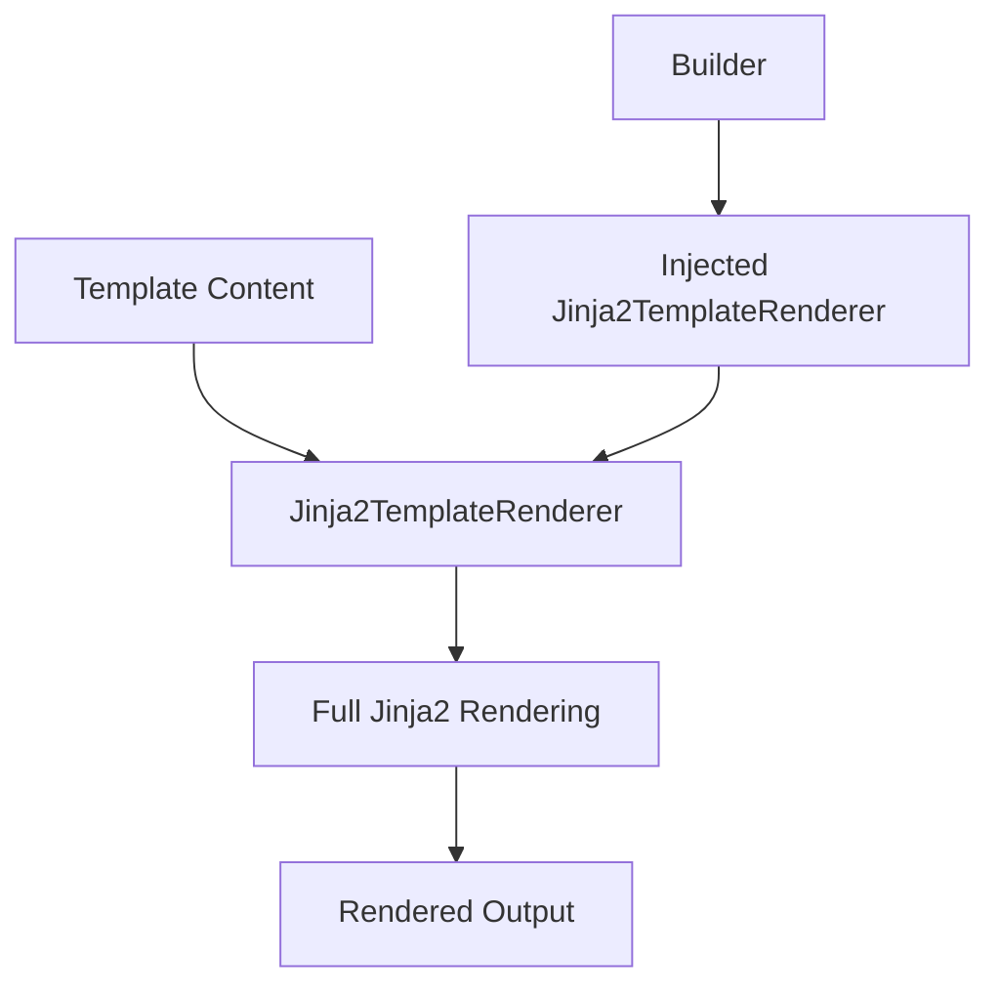

# ARD: Template Handler Integration

## Context

The existing codebase has a template handler system using the `TemplateVariableHandler` protocol that supports variable substitution in the form `{{VARIABLE}}`. The new Jinja2 implementation needs to integrate with this existing system while providing enhanced templating capabilities.

Key requirements:
- Modify existing template_handlers appropriately for Jinja2 integration
- Maintain backwards compatibility with existing `{{VARIABLE}}` patterns
- Extend the handler system to support advanced Jinja2 features
- Ensure existing Builder classes can use both old and new template systems

## Decision

Replace the existing template system entirely with Jinja2. Since backwards compatibility is not required, create a new `Jinja2TemplateRenderer` that implements the `TemplateVariableHandler` protocol and provides full Jinja2 templating capabilities.

### Architecture Overview

1. **Single Template System:**
    - All templates use Jinja2 syntax and features
    - No fallback to string replacement
    - Unified handling for all template operations

2. **Handler Implementation:**
    - `Jinja2TemplateRenderer`: Implements `TemplateVariableHandler` protocol
    - Handles all Jinja2 features: variables, filters, conditionals, loops, macros, includes
    - Custom error handling and logging

3. **Builder Integration:**
    - Builders use injected `Jinja2TemplateRenderer` instances
    - All template processing goes through Jinja2 engine
    - Consistent behavior across all template operations

### Implementation Details

#### Jinja2TemplateRenderer Implementation
```python
class Jinja2TemplateRenderer:
    """Handles all Jinja2 templating features: variables, filters, conditionals, loops, macros, includes."""

    def __init__(self, environment: jinja2.Environment):
        self.environment = environment

    def can_handle(self, variable_name: str) -> bool:
        return True  # Handles all template variables with Jinja2

    def handle(self, variable_name: str, config: dict[str, Any]) -> str:
        # All templates use Jinja2 - no fallback to string replacement
        try:
            template = self.environment.from_string(variable_name)
            return template.render(**config)
        except jinja2.TemplateError as e:
            raise TemplateRenderingError(f"Jinja2 error: {e}") from e
```

## Status

Proposed

## Consequences

### Positive
- **Single Template System:** One unified engine for all template operations
- **Full Jinja2 Feature Set:** Variables, filters, conditionals, loops, macros, and includes available everywhere
- **Simplified Architecture:** No routing logic or syntax detection required
- **Type Safety:** Protocol-based design maintains type checking

### Negative
- **Breaking Change:** All existing handlers and their tests must be rewritten
- **No Incremental Migration:** Teams must adopt Jinja2 all at once
- **Performance:** Jinja2 overhead applies to all templates, including simple variable substitution cases

### Neutral
- **API Stability:** Core protocol remains unchanged
- **Documentation:** Existing template documentation will need to be fully replaced

## Alternatives Considered

### Alternative 1: Replace All Handlers with Jinja2
**Pros:**
- Single, consistent template system
- All handlers get Jinja2 features automatically
- Simplified codebase

**Cons:**
- Breaks existing functionality
- Forces all handlers to support Jinja2
- May introduce performance overhead for simple cases
- Requires updating all existing handlers immediately

**Decision:** Accepted - chosen approach

### Alternative 2: Separate Template Systems
**Pros:**
- Clean separation between old and new systems
- No interference between implementations
- Easier testing and debugging

**Cons:**
- Code duplication in Builder classes
- Configuration complexity
- Harder to migrate gradually
- Two different APIs to maintain

**Decision:** Rejected - increases complexity and maintenance burden

### Alternative 3: Feature Flags for Jinja2 Support
**Pros:**
- Gradual rollout with feature flags
- Easy to enable/disable Jinja2 features
- Backwards compatible by default

**Cons:**
- Configuration complexity
- Runtime feature detection
- Harder to test all combinations
- Feature flag maintenance overhead

**Decision:** Rejected - over-engineering for this use case

### Alternative 4: Template Type Detection
**Pros:**
- Automatic detection of template complexity
- No configuration required
- Seamless user experience

**Cons:**
- Heuristic-based detection may have edge cases
- Performance overhead for detection
- False positives/negatives possible

**Decision:** Rejected - detection logic is unnecessary given full replacement approach

## Related Documents

- PRD: [PRD_JINJA2_TEMPLATES.md](../prd/PRD_JINJA2_TEMPLATES.md)
- ARD: [ARD_JINJA2_ENGINE_SELECTION.md](ARD_JINJA2_ENGINE_SELECTION.md)
- ARD: [ARD_DEPENDENCY_INJECTION_DESIGN.md](ARD_DEPENDENCY_INJECTION_DESIGN.md)

---

