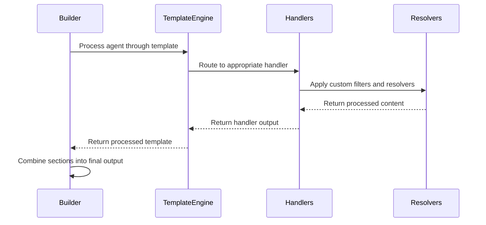

# Builder Architecture and Factory Pattern

## Overview

The Builder architecture in Promptosaurus is responsible for transforming Intermediate Representation (IR) models into tool-specific output formats. It uses a factory pattern for builder instantiation and a protocol-based system for optional feature support.

## Core Components

### Builder Base Class
**File:** `promptosaurus/builders/base.py`

The Builder base class defines the interface that all tool-specific builders must implement. It ensures consistent behavior across different tool targets while providing common functionality.

**Key Methods:**
- `build(agent, options)`: Abstract method to transform Agent IR to tool-specific output
- `validate(agent)`: Abstract method to validate an Agent IR model for builder-specific requirements
- `supports_feature(feature_name)`: Check if builder supports optional features (skills, workflows, rules, subagents, tools)
- `get_output_format()`: Get human-readable description of output format
- `get_tool_name()`: Get the name of the tool this builder targets

**BuildOptions Configuration:**
The BuildOptions dataclass provides configuration for the build process:
- `variant`: Build variant ('minimal' or 'verbose')
- `agent_name`: Name of the agent being built (for context in error messages)
- `include_subagents`: Whether to include subagents in output
- `include_skills`: Whether to include skills in output
- `include_workflows`: Whether to include workflows in output
- `include_rules`: Whether to include rules in output
- `include_tools`: Whether to include tools in output

### Builder Factory
**File:** `promptosaurus/builders/factory.py`

The BuilderFactory implements the factory pattern for creating and managing builder instances. It maintains a registry of builder classes and provides a clean API for getting builder instances.

**Key Methods:**
- `register(tool_name, builder_class)`: Register a builder class for a tool
- `get_builder(tool_name)`: Get a builder instance for the specified tool
- `list_builders()`: List all registered tool names
- `has_builder(tool_name)`: Check if a builder is registered for a tool
- `clear()`: Clear all registered builders (primarily for testing)
- `get_builder_info(tool_name)`: Get metadata about a registered builder

### Protocol-Based Feature Support
**File:** `promptosaurus/builders/interfaces.py`

Instead of traditional inheritance, Promptosaurus uses typing.Protocol for optional builder features. This provides structural subtyping without runtime overhead or tight coupling.

**Available Protocols:**
- `SupportsSkills`: For builders that support building skills
- `SupportsWorkflows`: For builders that support building workflows
- `SupportsRules`: For builders that support building rules
- `SupportsSubagents`: For builders that support building subagents
- `SupportsTools`: For builders that support building tools

**Benefits of Protocol Approach:**
1. **Structural Subtyping:** No need to explicitly inherit from protocol classes
2. **Type Safety:** Type system understands the relationship without runtime overhead
3. **Flexibility:** Third-party builders can implement protocols without modifying core code
4. **Clear Intent:** Explicitly declares which optional features a builder supports

## Builder Implementation Flow

```mermaid
graph TD
    A[Request Builder] --> B[BuilderFactory.get_builder()]
    B --> C{Builder Registered?}
    C -->|Yes| D[Instantiate Builder Class]
    C -->|No| E[Raise BuilderNotFoundError]
    D --> F[Validate Agent Model]
    F --> G{Validation Passed?}
    G -->|Yes| H[Build Tool-Specific Output]
    G -->|No| I[Return Validation Errors]
    H --> J[Apply Build Options]
    J --> K[Process Through Template Engine]
    K --> L[Return Final Output]
```

## Tool-Specific Builders

### KiloBuilder
**File:** `promptosaurus/builders/kilo_builder.py`

Builds output for Kilo Code AI tool. Generates configuration files for Kilo's agent system.

**Output Format:** YAML-based configuration with specific sections for different agent capabilities.

### ClaudeBuilder
**File:** `promptosaurus/builders/claude_builder.py`

Builds output for Claude AI tool. Generates prompt files and configuration for Claude's agent system.

**Output Format:** Markdown files, returns `dict[str, str]` mapping file paths to content.

### ClineBuilder
**File:** `promptosaurus/builders/cline_builder.py`

Builds output for Cline AI tool. Generates configuration files for Cline's agent system.

**Output Format:** Markdown (`.clinerules`) files.

### CopilotBuilder
**File:** `promptosaurus/builders/copilot_builder.py`

Builds output for GitHub Copilot. Generates configuration files for Copilot's agent system.

**Output Format:** YAML frontmatter + Markdown.

## Template System Integration

Builders delegate template processing to the template handler system:



## Custom Builder Creation

To create a new builder for an unsupported tool:

1. **Inherit from Builder:**
```python
from promptosaurus.builders.base import Builder, BuildOptions
from promptosaurus.ir.models import Agent
from typing import Any

class MyToolBuilder(Builder):
    def build(self, agent: Agent, options: BuildOptions) -> str | dict[str, Any]:
        # Implement tool-specific build logic
        pass
    
    def validate(self, agent: Agent) -> list[str]:
        # Implement tool-specific validation
        pass
    
    def get_output_format(self) -> str:
        return "MyTool Format"
    
    def get_tool_name(self) -> str:
        return "mytool"
```

2. **Register with Factory:**
```python
from promptosaurus.builders.factory import BuilderFactory

BuilderFactory.register("mytool", MyToolBuilder)
```

3. **Use the Builder:**
```python
from promptosaurus.builders.factory import BuilderFactory
from promptosaurus.ir.models import Agent
from promptosaurus.builders.base import BuildOptions

agent = Agent(
    name="my-agent",
    description="My custom agent",
    system_prompt="You are a helpful agent"
)

builder = BuilderFactory.get_builder("mytool")
output = builder.build(agent, BuildOptions(variant="verbose"))
```

## Best Practices

1. **Follow Single Responsibility:** Each builder should focus solely on tool-specific transformation logic
2. **Implement Comprehensive Validation:** Validate all tool-specific requirements in the validate() method
3. **Handle Build Options Properly:** Respect all BuildOptions flags in the build() method
4. **Provide Clear Error Messages:** Validation errors should be specific and actionable
5. **Support Both Variants:** Implement both minimal and verbose build variants when meaningful
6. **Use Protocol Implementation:** Implement only the protocols your builder actually supports
7. **Document Output Format:** Clearly describe what format your builder produces
8. **Test Thoroughly:** Test validation, building, and edge cases with various agent configurations
9. **Keep Builders Stateless:** Builders should not maintain state between builds
10. **Follow Naming Conventions:** Use `{ToolName}Builder` for builder class names
