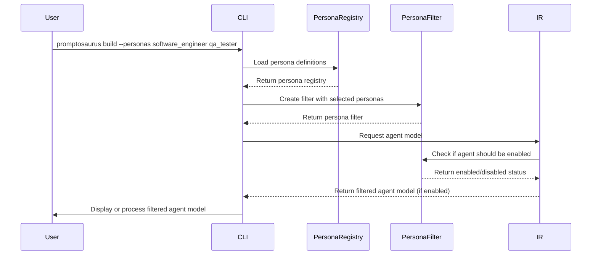
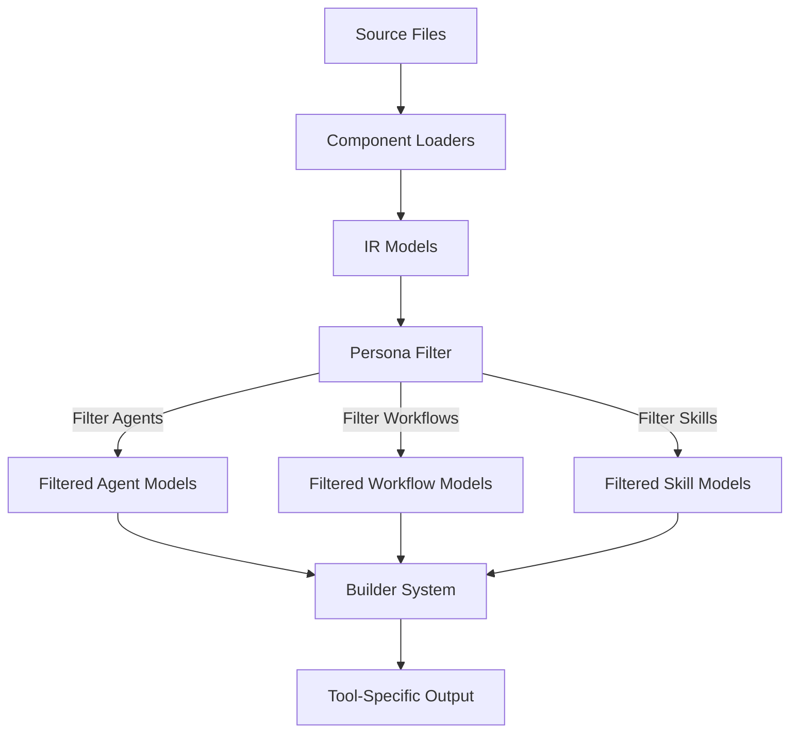

# Persona Filtering System

## Overview

The Persona filtering system enables role-based selection of agents, workflows, and skills in Promptosaurus. It implements dynamic agent enabling/disabling based on selected personas, allowing users to tailor the available functionality to their specific role or context.

## Core Components

### PersonaRegistry
**File:** `promptosaurus/personas/registry.py`

The PersonaRegistry loads and manages persona definitions from a YAML file. It provides methods to query persona information, agent mappings, workflow mappings, and skill mappings.

**Key Methods:**
- `from_yaml(yaml_path)`: Create registry from personas.yaml file
- `list_personas()`: Get list of all persona identifiers
- `get_persona_info(persona_name)`: Get full persona definition
- `get_agents_for_persona(persona_name)`: Get all agents (primary + secondary) for a persona
- `get_workflows_for_persona(persona_name)`: Get workflows mapped to a persona
- `get_skills_for_persona(persona_name)`: Get skills mapped to a persona
- `get_universal_agents()`: Get list of universal agents (always enabled)
- `get_display_name(persona_name)`: Get user-friendly display name for persona
- `get_description(persona_name)`: Get persona description

### PersonaFilter
**File:** `promptosaurus/personas/registry.py`

The PersonaFilter implements the dynamic agent enabling/disabling mechanism. Agents are enabled if present in ANY selected persona, disabled otherwise. Universal agents are always enabled.

**Key Methods:**
- `__init__(registry, selected_personas)`: Initialize filter with registry and selected personas
- `get_enabled_agents()`: Get all agents that should be enabled for selected personas
- `get_enabled_workflows()`: Get all workflows that should be enabled for selected personas
- `get_enabled_skills()`: Get all skills that should be enabled for selected personas
- `is_agent_enabled(agent_name)`: Check if a specific agent should be enabled
- `is_workflow_enabled(workflow_name)`: Check if a specific workflow should be enabled
- `is_skill_enabled(skill_name)`: Check if a specific skill should be enabled
- `get_selected_personas()`: Get list of currently selected personas

## Persona Definition Format

Personas are defined in `promptosaurus/personas/personas.yaml` with the following structure:

```yaml
version: "1.0.0"
universal_agents:
  - "ask"
  - "orchestrator"

personas:
  software_engineer:
    display_name: "Software Engineer"
    description: "Full-stack software engineer"
    focus: "Building and maintaining software applications"
    primary_agents:
      - "code"
      - "test"
      - "debug"
    secondary_agents:
      - "architect"
      - "review"
    workflows:
      - "feature-development"
      - "bug-fixing"
      - "code-review"
    skills:
      - "implementation"
      - "debugging"
      - "testing"
      - "documentation"
```

**Persona Fields:**
- `display_name`: User-friendly name for the persona
- `description`: Detailed description of the persona's role and responsibilities
- `focus`: Primary area of focus for this persona
- `primary_agents`: Agents that are primarily associated with this persona
- `secondary_agents`: Agents that are secondarily associated with this persona
- `workflows`: Workflows that this persona commonly uses
- `skills`: Skills that this persona commonly leverages

## Data Flow and Usage



## Dynamic Enabling/Disabling Algorithm

The PersonaFilter implements the following algorithm for determining enabled agents:

1. **Start with Universal Agents:** Always include agents listed in `universal_agents`
2. **Add Agents from Selected Personas:** For each selected persona, add both primary and secondary agents
3. **Enable if Present in ANY Selected Persona:** An agent is enabled if it appears in the agent list of at least one selected persona
4. **Apply Same Logic to Workflows and Skills:** Use identical algorithm for workflows and skills

**Example:**
- Selected personas: `["software_engineer", "qa_tester"]`
- Universal agents: `["ask", "orchestrator"]`
- Software engineer agents: `["code", "test", "debug", "architect", "review"]`
- QA tester agents: `["test", "review", "debug"]`
- **Enabled agents:** `["ask", "orchestrator", "code", "test", "debug", "architect", "review"]`

## Integration with Builder System

The persona filtering system integrates with the builder system during the IR loading phase:



## Extending the Persona System

### Adding New Personas

1. Edit `promptosaurus/personas/personas.yaml`
2. Add a new entry under the `personas` key
3. Define all required fields: display_name, description, focus, primary_agents, secondary_agents, workflows, skills
4. Optionally add to `universal_agents` if the agent should be available to all personas

### Creating Custom Persona Sources

To load personas from a different source:

```python
from promptosaurus.personas.registry import PersonaRegistry
import json

# Load from JSON instead of YAML
def load_personas_from_json(json_path):
    with open(json_path, 'r') as f:
        data = json.load(f)
    return PersonaRegistry(data)

# Usage
registry = load_personas_from_json("my-personas.json")
```

## Best Practices

1. **Keep Personas Focused:** Each persona should have a clear, distinct focus area
2. **Use Universal Agents Sparingly:** Only include agents that are truly needed by all personas
3. **Maintain Consistency:** Use consistent naming conventions for agents, workflows, and skills across personas
4. **Document Rationale:** Include comments in the YAML file explaining why certain agents/workflows/skills are assigned to each persona
5. **Review Regularly:** Periodically review persona definitions to ensure they match evolving role requirements
6. **Leverage Hierarchy:** Consider if some personas are specializations of others and organize accordingly
7. **Test Filtering:** Verify that the filtering logic produces expected results for various persona combinations
8. **Keep Definitions DRY:** Avoid duplicating common agent/workflow/skill lists across similar personas
9. **Use Descriptive Names:** Choose clear, descriptive names for persona identifiers
10. **Validate Definitions:** Ensure all referenced agents, workflows, and skills actually exist in the system
