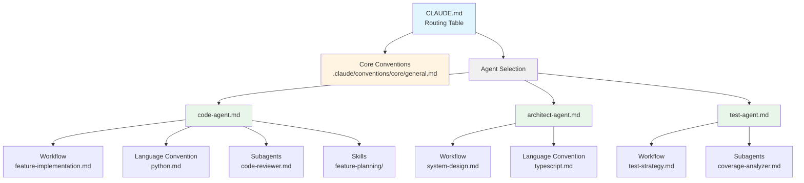

# Claude Artifact Generation Redesign

**Status:** Design Phase  
**Date:** 2026-04-14  
**Owner:** System Architecture  

## Table of Contents
- [Overview](#overview)
- [Current State Analysis](#current-state-analysis)
- [Proposed Architecture](#proposed-architecture)
- [File Structure](#file-structure)
- [Naming Conventions](#naming-conventions)
- [CLAUDE.md Format](#claudemd-format)
- [Agent File Format](#agent-file-format)
- [Workflow Integration](#workflow-integration)
- [Implementation Plan](#implementation-plan)
- [Migration Strategy](#migration-strategy)

---

## Overview

### Problem Statement

Current Claude artifact generation creates JSON files in `custom_instructions/` which:
- ❌ Is not clearly Claude-specific (confusing ownership)
- ❌ Uses JSON format (less readable than Markdown)
- ❌ Doesn't match the `.kilo/`, `.cursor/` directory pattern
- ❌ Generates universal AGENTS.md that doesn't fit Claude's agent-routing model
- ❌ Lacks clear hierarchy for subagents, workflows, skills

### Solution Summary

Redesign Claude artifact generation to:
- ✅ Store everything under `.claude/` directory
- ✅ Use Markdown files with routing instructions
- ✅ Generate `CLAUDE.md` with agent registry and routing rules
- ✅ Support lazy-loading of conventions, workflows, and skills
- ✅ Use kebab-case naming for better readability

---

## Current State Analysis

### Current Directory Structure

```
project/
├── AGENTS.md                          ← Universal (all tools)
├── custom_instructions/               ← Claude JSON files (confusing)
│   ├── ask.json                       ← 52KB JSON
│   ├── code.json                      ← 52KB JSON
│   ├── refactor.json                  ← 52KB JSON
│   └── ...                            ← 14 agent files
└── .claude/
    └── skills/                        ← Only skills, no agents
        ├── feature-planning/
        ├── post-implementation-checklist/
        └── ...
```

### Current Problems

| Issue | Impact | Severity |
|-------|--------|----------|
| `custom_instructions/` ambiguous | Unclear which tool owns it | High |
| JSON format | Hard to read/edit | Medium |
| No agent hierarchy | Flat structure, hard to navigate | Medium |
| Universal AGENTS.md | Doesn't leverage Claude's routing | High |
| No subagent support | Missing capability for Claude | High |
| snake_case files | Less readable in paths | Low |

---

## Proposed Architecture

### New Directory Structure

```
project/
├── CLAUDE.md                          ← Claude-specific routing (NEW)
└── .claude/
    ├── agents/                        ← Primary agents (NEW)
    │   ├── architect-agent.md
    │   ├── ask-agent.md
    │   ├── backend-agent.md
    │   ├── code-agent.md
    │   ├── debug-agent.md
    │   ├── enforcement-agent.md
    │   ├── explain-agent.md
    │   ├── frontend-agent.md
    │   ├── migration-agent.md
    │   ├── orchestrator-agent.md
    │   ├── performance-agent.md
    │   ├── plan-agent.md
    │   ├── refactor-agent.md
    │   ├── review-agent.md
    │   └── test-agent.md
    │
    ├── subagents/                     ← Helper agents (NEW)
    │   ├── code-reviewer.md           ← review/code.md
    │   ├── accessibility-checker.md   ← review/accessibility.md
    │   ├── performance-analyzer.md    ← performance/bottleneck-analysis.md
    │   ├── api-designer.md            ← backend/api-design.md
    │   ├── mobile-specialist.md       ← frontend/mobile.md
    │   ├── rubber-duck.md             ← debug/rubber-duck.md
    │   └── ...                        ← All existing subagents
    │
    ├── workflows/                     ← Multi-step processes (NEW)
    │   ├── feature-implementation.md  ← code workflow
    │   ├── deep-research.md           ← orchestrator workflow
    │   ├── code-review.md             ← review workflow
    │   ├── refactor-strategy.md       ← refactor workflow
    │   └── ...
    │
    ├── skills/                        ← Reusable capabilities (EXISTS)
    │   ├── feature-planning/
    │   ├── post-implementation-checklist/
    │   ├── data-validation-pipelines/
    │   └── ...
    │
    └── conventions/                   ← Rules and standards (NEW)
        ├── core/
        │   └── general.md             ← System + session + core rules
        └── languages/
            ├── python.md              ← Python conventions
            ├── typescript.md          ← TypeScript conventions
            ├── rust.md                ← Rust conventions
            └── golang.md              ← Go conventions
```

### Architecture Diagram



---

## File Structure

### Comparison: Current vs Proposed

| Aspect | Current | Proposed |
|--------|---------|----------|
| **Root file** | `AGENTS.md` (universal) | `CLAUDE.md` (Claude-specific) |
| **Agent storage** | `custom_instructions/*.json` | `.claude/agents/*.md` |
| **Format** | JSON (52KB each) | Markdown with references |
| **Subagents** | None for Claude | `.claude/subagents/*.md` |
| **Workflows** | Embedded in JSON | `.claude/workflows/*.md` |
| **Skills** | `.claude/skills/` | `.claude/skills/` (same) |
| **Conventions** | Embedded in JSON | `.claude/conventions/` |

### Agent Count by Persona

For **Software Engineer** persona (14 primary agents):

| Agent | Has Subagents? | Has Workflows? | File Size Estimate |
|-------|----------------|----------------|-------------------|
| architect-agent | No | Yes | ~2KB |
| ask-agent | Yes (3) | No | ~1.5KB |
| backend-agent | Yes (4) | Yes | ~2KB |
| code-agent | Yes (6) | Yes | ~2.5KB |
| debug-agent | Yes (3) | Yes | ~2KB |
| enforcement-agent | No | Yes | ~1.5KB |
| explain-agent | Yes (1) | No | ~1.5KB |
| frontend-agent | Yes (4) | Yes | ~2KB |
| migration-agent | Yes (1) | Yes | ~1.5KB |
| orchestrator-agent | Yes (4) | Yes | ~2.5KB |
| performance-agent | Yes (4) | Yes | ~2KB |
| plan-agent | No | Yes | ~1.5KB |
| refactor-agent | Yes (1) | Yes | ~1.5KB |
| review-agent | Yes (3) | Yes | ~2KB |
| test-agent | Yes (1) | Yes | ~1.5KB |

**Total**: ~28KB of agent files vs ~728KB of JSON files (96% reduction)

---

## Naming Conventions

### File Naming Rules

**Primary Agents**: `{name}-agent.md`
- ✅ `code-agent.md`
- ✅ `architect-agent.md`
- ✅ `frontend-agent.md`
- ❌ ~~`code.md`~~ (too ambiguous)
- ❌ ~~`code_agent.md`~~ (snake_case)

**Subagents**: `{descriptive-name}.md`
- ✅ `code-reviewer.md`
- ✅ `accessibility-checker.md`
- ✅ `rubber-duck.md`
- ❌ ~~`code-review.md`~~ (confusing with workflow)
- ❌ ~~`reviewer.md`~~ (too generic)

**Workflows**: `{process-name}.md`
- ✅ `feature-implementation.md`
- ✅ `code-review.md`
- ✅ `deep-research.md`
- ❌ ~~`feature.md`~~ (too short)
- ❌ ~~`implementation-workflow.md`~~ (redundant suffix)

**Skills**: `{capability-name}/SKILL.md`
- ✅ `feature-planning/SKILL.md`
- ✅ `data-validation-pipelines/SKILL.md`
- (No change from current structure)

**Conventions**: `{type}/{name}.md`
- ✅ `core/general.md`
- ✅ `languages/python.md`
- ✅ `languages/typescript.md`

### Name Mapping Table

From current agent names to new file names:

| Current Agent Name | New Agent File | New Subagent Files |
|-------------------|----------------|-------------------|
| code | code-agent.md | code-reviewer.md, boilerplate-generator.md, dependency-upgrader.md, feature-implementer.md, house-style-enforcer.md, migration-helper.md |
| frontend | frontend-agent.md | accessibility-checker.md, mobile-specialist.md, react-pattern-advisor.md, vue-pattern-advisor.md |
| backend | backend-agent.md | api-designer.md, caching-strategist.md, microservices-architect.md, storage-advisor.md |
| performance | performance-agent.md | benchmarking-specialist.md, bottleneck-analyzer.md, optimization-strategist.md, profiling-expert.md |
| review | review-agent.md | accessibility-reviewer.md, code-reviewer.md, performance-reviewer.md |
| orchestrator | orchestrator-agent.md | devops-coordinator.md, maintenance-manager.md, meta-orchestrator.md, pr-description-writer.md |
| debug | debug-agent.md | log-analyzer.md, root-cause-investigator.md, rubber-duck.md |
| ask | ask-agent.md | decision-logger.md, documentation-writer.md, testing-advisor.md |
| refactor | refactor-agent.md | refactor-strategist.md |
| migration | migration-agent.md | migration-strategist.md |
| test | test-agent.md | test-strategist.md |
| explain | explain-agent.md | explainer-strategist.md |
| architect | architect-agent.md | (none) |
| enforcement | enforcement-agent.md | (none) |
| plan | plan-agent.md | (none) |

---

## CLAUDE.md Format

### Template Structure

```markdown
# Claude Configuration

**Last Updated:** {YYYY-MM-DD}  
**Agent Count:** {N} primary agents  
**Persona:** {persona_name}

## Core Conventions

**ALWAYS load first, before any agent:**

```
.claude/conventions/core/general.md
```

This file contains:
- System startup checklist (branch check, session management)
- Feature branch naming conventions
- General development rules
- Session management protocol
- Core conventions (repository structure, error handling, imports)

## Agent Registry

Match the user's request to **ONE** agent and load **ONLY** that file.

| Agent | Purpose | File Path |
|-------|---------|-----------|
| architect-agent | System design, architecture planning, technical decisions | .claude/agents/architect-agent.md |
| ask-agent | Answer questions, provide explanations | .claude/agents/ask-agent.md |
| backend-agent | Design scalable backend systems, APIs, microservices | .claude/agents/backend-agent.md |
| code-agent | Write, edit, refactor code | .claude/agents/code-agent.md |
| debug-agent | Diagnose and fix bugs, issues, errors | .claude/agents/debug-agent.md |
| enforcement-agent | Review code against coding standards | .claude/agents/enforcement-agent.md |
| explain-agent | Code walkthroughs, onboarding assistance | .claude/agents/explain-agent.md |
| frontend-agent | Build accessible, performant UIs for web and mobile | .claude/agents/frontend-agent.md |
| migration-agent | Handle dependency upgrades, framework migrations | .claude/agents/migration-agent.md |
| orchestrator-agent | Coordinate multi-step workflows, manage complex tasks | .claude/agents/orchestrator-agent.md |
| performance-agent | Optimize application performance, identify bottlenecks | .claude/agents/performance-agent.md |
| plan-agent | Develop PRDs, work with architects on ARDs | .claude/agents/plan-agent.md |
| refactor-agent | Improve code structure while preserving behavior | .claude/agents/refactor-agent.md |
| review-agent | Code, performance, and accessibility reviews | .claude/agents/review-agent.md |
| test-agent | Write comprehensive tests with coverage-first approach | .claude/agents/test-agent.md |

## Routing Rules

Match the user's request to the appropriate agent:

### Code Implementation
- **Keywords:** "write", "implement", "create", "build", "add feature"
- **Agent:** code-agent

### System Design
- **Keywords:** "design", "architect", "plan system", "design database"
- **Agent:** architect-agent

### Bug Fixing
- **Keywords:** "debug", "fix bug", "not working", "error", "failing"
- **Agent:** debug-agent

### Code Review
- **Keywords:** "review", "check code", "audit", "assess quality"
- **Agent:** review-agent

### Testing
- **Keywords:** "test", "write tests", "coverage", "test suite"
- **Agent:** test-agent

### Refactoring
- **Keywords:** "refactor", "improve code", "clean up", "restructure"
- **Agent:** refactor-agent

### Performance
- **Keywords:** "optimize", "performance", "slow", "speed up", "benchmark"
- **Agent:** performance-agent

### Documentation
- **Keywords:** "document", "explain", "write docs", "README"
- **Agent:** explain-agent

### Questions
- **Keywords:** "how does", "what is", "explain", "why"
- **Agent:** ask-agent

### Multi-step Workflows
- **Keywords:** "coordinate", "manage", "orchestrate", "complex task"
- **Agent:** orchestrator-agent

## Instructions

1. **Load core conventions:**
   ```
   Read: .claude/conventions/core/general.md
   ```

2. **Analyze the user's request** and match to ONE agent using the routing rules above

3. **Load that agent's file:**
   ```
   Read: .claude/agents/{selected-agent}.md
   ```

4. **Follow the agent's instructions** - The agent file will tell you:
   - What workflow to load
   - What language conventions to load
   - What subagents to load
   - What skills to load
   
5. **Do NOT load anything else** until the agent file explicitly instructs you to

## Notes

- Each agent file is self-contained with all necessary references
- Language conventions are loaded by workflows, not upfront
- Skills are loaded on-demand when workflows require them
- Subagents are loaded only when the primary agent delegates to them
```

### Dynamic Content Generation

The CLAUDE.md file is **generated dynamically** based on:
- Active personas (filters which agents appear)
- Agent descriptions from IR models
- Current configuration (variant, language, etc.)

---

## Agent File Format

### Template Structure

```markdown
# {Agent Name}

**Purpose:** {One-line description}  
**When to Use:** {Scenario description}

## Role

{Detailed role description - 2-3 sentences}

## Workflow

**Read and follow this workflow file:**

```
.claude/workflows/{workflow-name}.md
```

This workflow will:
- {Key step 1}
- {Key step 2}
- {Key step 3}

## Subagents

This agent can delegate to the following subagents when needed:

| Subagent | Purpose | File Path | When to Use |
|----------|---------|-----------|-------------|
| {name} | {purpose} | .claude/subagents/{file}.md | {scenario} |

**Loading Instructions:**
- Do NOT load subagents upfront
- Load each subagent only when the workflow step requires it
- Each subagent file contains specific instructions for that capability

## Skills

Skills are reusable capabilities. Load only when workflow requires:

| Skill | Purpose | File Path | When to Use |
|-------|---------|-----------|-------------|
| {name} | {purpose} | .claude/skills/{skill}/SKILL.md | {scenario} |

**Loading Instructions:**
- Skills are loaded on-demand
- The workflow will specify which skill to use at each step
- Read the skill file when the workflow references it

## Instructions

### Startup Sequence

1. **Read the workflow file now:**
   ```
   Read: .claude/workflows/{workflow-name}.md
   ```

2. **Follow the workflow steps sequentially**

3. **Load resources as the workflow directs:**
   - Language conventions (when workflow detects language)
   - Subagents (when workflow delegates)
   - Skills (when workflow requires capability)

### Language Convention Loading

The workflow will detect the language being used and instruct you to load:

```
.claude/conventions/languages/{detected-language}.md
```

Only load the convention for the language in use. Do not load other languages.

### Delegation Pattern

When the workflow instructs you to delegate to a subagent:

1. Read the subagent file
2. Follow its instructions
3. Return results to the primary workflow
4. Continue with the next workflow step

## Notes

{Any agent-specific notes, quirks, or special instructions}
```

### Example: Code Agent

```markdown
# Code Agent

**Purpose:** Write, edit, and refactor code following project conventions  
**When to Use:** Implementing features, fixing bugs, refactoring existing code

## Role

You are a senior software engineer responsible for writing high-quality, maintainable code. You follow established patterns, write tests alongside code, and ensure all changes meet project standards. You work iteratively and confirm design decisions before major changes.

## Workflow

**Read and follow this workflow file:**

```
.claude/workflows/feature-implementation.md
```

This workflow will guide you through:
- Understanding requirements
- Planning implementation
- Writing code incrementally
- Testing as you go
- Self-review before completion

## Subagents

This agent can delegate to the following subagents when needed:

| Subagent | Purpose | File Path | When to Use |
|----------|---------|-----------|-------------|
| code-reviewer | Review code for quality, patterns, bugs | .claude/subagents/code-reviewer.md | After implementation, before commit |
| boilerplate-generator | Generate standard code structures | .claude/subagents/boilerplate-generator.md | When creating new modules/classes |
| dependency-upgrader | Handle dependency updates safely | .claude/subagents/dependency-upgrader.md | When upgrading packages |
| feature-implementer | Implement specific feature types | .claude/subagents/feature-implementer.md | For complex feature work |
| house-style-enforcer | Apply project-specific code style | .claude/subagents/house-style-enforcer.md | When style consistency is critical |
| migration-helper | Assist with code migrations | .claude/subagents/migration-helper.md | During refactoring or framework changes |

**Loading Instructions:**
- Do NOT load subagents upfront
- Load each subagent only when the workflow step requires it
- Each subagent file contains specific instructions for that capability

## Skills

Skills are reusable capabilities. Load only when workflow requires:

| Skill | Purpose | File Path | When to Use |
|-------|---------|-----------|-------------|
| feature-planning | Plan feature implementation | .claude/skills/feature-planning/SKILL.md | Before starting complex features |
| post-implementation-checklist | Verify completeness | .claude/skills/post-implementation-checklist/SKILL.md | After code completion |

**Loading Instructions:**
- Skills are loaded on-demand
- The workflow will specify which skill to use at each step
- Read the skill file when the workflow references it

## Instructions

### Startup Sequence

1. **Read the workflow file now:**
   ```
   Read: .claude/workflows/feature-implementation.md
   ```

2. **Follow the workflow steps sequentially**

3. **Load resources as the workflow directs:**
   - Language conventions (when workflow detects language)
   - Subagents (when workflow delegates)
   - Skills (when workflow requires capability)

### Language Convention Loading

The workflow will detect the language being used and instruct you to load:

```
.claude/conventions/languages/{detected-language}.md
```

Common languages in this project:
- Python: `.claude/conventions/languages/python.md`
- TypeScript: `.claude/conventions/languages/typescript.md`

Only load the convention for the language in use. Do not load other languages.

### Delegation Pattern

When the workflow instructs you to delegate to a subagent:

1. Read the subagent file
2. Follow its instructions
3. Return results to the primary workflow
4. Continue with the next workflow step

## Notes

- Always run tests before marking work complete
- Follow the project's feature branch naming convention
- Update session file after significant work
- Ask for clarification on ambiguous requirements before implementing
```

---

## Workflow Integration

### Workflow File Structure

```markdown
# {Workflow Name}

**Purpose:** {One-line description}  
**Typical Duration:** {time estimate}  
**Prerequisites:** {what must be true before starting}

## Overview

{2-3 sentences describing the workflow}

## Step 1: Language Detection

**Detect the language** being used:

```bash
# Check file extensions in scope
# OR ask user if unclear
```

**Load the appropriate language convention:**

```
IF language = python:
    Read: .claude/conventions/languages/python.md
ELSE IF language = typescript:
    Read: .claude/conventions/languages/typescript.md
ELSE IF language = rust:
    Read: .claude/conventions/languages/rust.md
ELSE IF language = golang:
    Read: .claude/conventions/languages/golang.md
```

**Do NOT proceed until language convention is loaded.**

## Step 2: {Step Name}

{Step instructions}

**Actions:**
- {Action 1}
- {Action 2}

**Load resources if needed:**
```
IF {condition}:
    Read: .claude/subagents/{subagent}.md
```

## Step 3: {Step Name}

{Continue with remaining steps...}

## Completion Criteria

- [ ] {Criteria 1}
- [ ] {Criteria 2}
- [ ] {Criteria 3}

## Notes

{Any workflow-specific notes}
```

### Example: Feature Implementation Workflow

```markdown
# Feature Implementation Workflow

**Purpose:** Implement a new feature from requirements to tested code  
**Typical Duration:** 30 minutes - 2 hours  
**Prerequisites:** Requirements understood, branch created, session active

## Overview

This workflow guides feature implementation following project standards. It emphasizes incremental development, testing as you go, and self-review before completion.

## Step 1: Language Detection

**Detect the language** being used for this feature:

```bash
# Check file extensions in the feature scope
# Look at existing files being modified
# Ask user if multiple languages or unclear
```

**Load the appropriate language convention:**

```
IF language = python:
    Read: .claude/conventions/languages/python.md
ELSE IF language = typescript:
    Read: .claude/conventions/languages/typescript.md
ELSE IF language = rust:
    Read: .claude/conventions/languages/rust.md
```

**Verify convention is loaded:**
- [ ] Language detected
- [ ] Convention file read
- [ ] Naming rules understood
- [ ] Error handling patterns understood

**Do NOT proceed until convention is loaded.**

## Step 2: Understand Requirements

**Read requirements carefully:**
- What is the feature?
- What are acceptance criteria?
- What are edge cases?

**If requirements are unclear:**
- Ask focused questions
- Do NOT make assumptions

**Load planning skill if feature is complex:**

```
IF feature_complexity > medium:
    Read: .claude/skills/feature-planning/SKILL.md
    Follow skill instructions
```

## Step 3: Plan Implementation

**Create implementation plan:**
- [ ] List files to modify/create
- [ ] Identify dependencies
- [ ] Estimate scope (S/M/L)
- [ ] Confirm plan with user if scope > S

**Delegate to boilerplate generator if creating new modules:**

```
IF creating_new_module:
    Read: .claude/subagents/boilerplate-generator.md
    Follow subagent instructions
    Return to this workflow
```

## Step 4: Implement Incrementally

**Write code in small chunks:**
- Implement one function/class at a time
- Follow language conventions loaded in Step 1
- Add type hints (Python) or types (TypeScript)
- Handle errors according to convention

**After each chunk:**
- [ ] Run related tests
- [ ] Fix any failures
- [ ] Continue to next chunk

## Step 5: Write Tests

**Write tests alongside code:**
- Unit tests for new functions
- Integration tests if needed
- Follow test patterns from language convention

**Test coverage:**
- [ ] Happy path covered
- [ ] Edge cases covered
- [ ] Error cases covered

## Step 6: Self-Review

**Delegate to code reviewer subagent:**

```
Read: .claude/subagents/code-reviewer.md
Follow review instructions
```

**Address review findings:**
- Fix any issues found
- Re-run tests after fixes

## Step 7: Final Checks

**Load post-implementation checklist:**

```
Read: .claude/skills/post-implementation-checklist/SKILL.md
Follow checklist
```

**Verify:**
- [ ] All tests passing
- [ ] No linter errors
- [ ] Type checking passes
- [ ] Session file updated
- [ ] Ready for user review

## Completion Criteria

- [ ] Feature implemented according to requirements
- [ ] All tests passing
- [ ] Code reviewed by code-reviewer subagent
- [ ] Post-implementation checklist complete
- [ ] User informed of completion

## Notes

- Stop and ask if uncertain about requirements
- Commit frequently in small chunks
- Run tests continuously, not just at the end
- Update session file after completing the workflow
```

---

## Implementation Plan

### Phase 1: Builder Changes (Week 1)

**1.1 Update ClaudeBuilder**
- [ ] Change output format from JSON to Markdown
- [ ] Implement agent file template rendering
- [ ] Add subagent file generation
- [ ] Add workflow file generation
- [ ] Add convention file generation

**1.2 Create Template System**
- [ ] Agent template (Jinja2)
- [ ] Subagent template (Jinja2)
- [ ] Workflow template (Jinja2)
- [ ] CLAUDE.md template (Jinja2)

**1.3 File Name Conversion**
- [ ] Implement kebab-case converter
- [ ] Map agent names → agent-file-names
- [ ] Map subagent names → subagent-file-names
- [ ] Map skill names → skill-file-names

### Phase 2: Artifact System (Week 1)

**2.1 Update Artifact Definitions**
```python
"claude": {
    "create": {".claude/"},  # Only .claude/
    "remove": {
        ".kilo/",
        ".opencode/",
        "custom_instructions/",  # Now removable
        "rules/",
        # ... other tools
    },
}
```

**2.2 Directory Structure**
- [ ] Create `.claude/agents/` directory
- [ ] Create `.claude/subagents/` directory
- [ ] Create `.claude/workflows/` directory
- [ ] Create `.claude/conventions/core/` directory
- [ ] Create `.claude/conventions/languages/` directory
- [ ] Keep `.claude/skills/` (already exists)

### Phase 3: Content Generation (Week 2)

**3.1 CLAUDE.md Generator**
- [ ] Build agent registry table
- [ ] Generate routing rules from agent descriptions
- [ ] Add instruction section
- [ ] Dynamic content based on active personas

**3.2 Agent File Generator**
- [ ] Extract agent metadata from IR models
- [ ] Map to subagents
- [ ] Map to workflows
- [ ] Map to skills
- [ ] Render agent markdown

**3.3 Convention File Generator**
- [ ] Extract core conventions
- [ ] Extract language-specific conventions
- [ ] Generate general.md
- [ ] Generate python.md, typescript.md, etc.

### Phase 4: Workflow Generator (Week 2)

**4.1 Workflow Extraction**
- [ ] Extract workflow from agent IR
- [ ] Convert to workflow markdown format
- [ ] Add language detection step
- [ ] Add completion criteria

**4.2 Subagent Extraction**
- [ ] Extract subagents from agent IR
- [ ] Convert to subagent markdown format
- [ ] Add delegation instructions

### Phase 5: Testing (Week 3)

**5.1 Unit Tests**
- [ ] Test ClaudeBuilder Markdown output
- [ ] Test file name conversion
- [ ] Test directory structure creation
- [ ] Test template rendering

**5.2 Integration Tests**
- [ ] Test full build for Claude
- [ ] Verify CLAUDE.md generation
- [ ] Verify all agent files created
- [ ] Verify no `.kilo/` artifacts
- [ ] Verify no `custom_instructions/` artifacts

**5.3 End-to-End Tests**
- [ ] Test `promptosaurus init` with Claude
- [ ] Test switching from Kilo to Claude
- [ ] Test switching from Claude to Kilo
- [ ] Verify artifact cleanup

### Phase 6: Documentation (Week 3)

**6.1 User Documentation**
- [ ] Update CLAUDE_BUILDER_GUIDE.md
- [ ] Add examples of new structure
- [ ] Document CLAUDE.md format
- [ ] Document agent file format

**6.2 Developer Documentation**
- [ ] Update builder implementation guide
- [ ] Document template system
- [ ] Document naming conventions

**6.3 User Documentation for Variant Switching**
- [ ] Add variant strategy section to user guide
- [ ] Document when to use VERBOSE vs MINIMAL
- [ ] Add workflow examples for switching during different project phases
- [ ] Include decision flowchart for variant selection
- [ ] Reference hybrid strategy guide and blog post
- [ ] Add examples: planning phase → implementation phase switching
- [ ] Document CLI commands for variant switching: `promptosaurus config set variant verbose`

---

## Migration Strategy

### For Users

**Current users with `custom_instructions/`:**

1. **Backup current state:**
   ```bash
   cp -r custom_instructions custom_instructions.backup
   cp -r .claude .claude.backup
   ```

2. **Run init with new version:**
   ```bash
   promptosaurus init
   # Select Claude
   ```

3. **Old artifacts removed automatically:**
   - `custom_instructions/` deleted
   - New `.claude/` structure created

4. **Verify:**
   ```bash
   ls -la .claude/
   # Should see: agents/, subagents/, workflows/, skills/, conventions/
   
   cat CLAUDE.md
   # Should see routing table
   ```

### For Developers

**Code changes required:**

```python
# Old (custom_instructions/)
builder = ClaudeBuilder()
json_output = builder.build(agent, options)  # Returns dict
write_json("custom_instructions/agent.json", json_output)

# New (.claude/)
builder = ClaudeBuilder()
md_output = builder.build(agent, options)  # Returns string
write_md(".claude/agents/agent-name.md", md_output)
```

**Template changes:**

```python
# Old template (JSON)
{
  "system": "{{ system_prompt }}",
  "tools": {{ tools }},
  "instructions": "{{ instructions }}"
}

# New template (Markdown)
# {{ agent.name }}

## Role
{{ agent.description }}

## Workflow
Read and follow: `.claude/workflows/{{ workflow_name }}.md`

## Subagents

- {{ subagent.name }}: `.claude/subagents/{{ subagent.file_name }}.md`

```

### Backward Compatibility

**Not maintained.** This is a breaking change for Claude artifacts.

**Rationale:**
- Current JSON format is not being used in production
- Structure is being designed now, not migrating production systems
- Clean break enables better architecture

---

## Success Metrics

### Metrics

| Metric | Current | Target | Measurement |
|--------|---------|--------|-------------|
| File size (all agents) | ~728KB | ~50KB | Total size of agent files |
| Readability | Low (JSON) | High (Markdown) | Manual review |
| Navigation time | High | Low | Time to find subagent |
| Clarity of ownership | Low | High | User survey |
| Artifact isolation | 90% | 100% | No cross-tool files |

### Validation Criteria

- [ ] CLAUDE.md generated correctly
- [ ] All 14 agents have agent files
- [ ] All subagents have subagent files
- [ ] All workflows extracted
- [ ] All conventions organized
- [ ] No `custom_instructions/` artifacts
- [ ] No `.kilo/` artifacts when building Claude
- [ ] Tests pass
- [ ] Documentation updated

---

## Appendix

### A. Complete File Listing

Example for **software_engineer** persona:

```
CLAUDE.md
.claude/
├── agents/
│   ├── architect-agent.md
│   ├── ask-agent.md
│   ├── backend-agent.md
│   ├── code-agent.md
│   ├── debug-agent.md
│   ├── enforcement-agent.md
│   ├── explain-agent.md
│   ├── frontend-agent.md
│   ├── migration-agent.md
│   ├── orchestrator-agent.md
│   ├── performance-agent.md
│   ├── plan-agent.md
│   ├── refactor-agent.md
│   ├── review-agent.md
│   └── test-agent.md
├── subagents/
│   ├── accessibility-checker.md
│   ├── accessibility-reviewer.md
│   ├── api-designer.md
│   ├── benchmarking-specialist.md
│   ├── boilerplate-generator.md
│   ├── bottleneck-analyzer.md
│   ├── caching-strategist.md
│   ├── code-reviewer.md
│   ├── decision-logger.md
│   ├── dependency-upgrader.md
│   ├── devops-coordinator.md
│   ├── documentation-writer.md
│   ├── explainer-strategist.md
│   ├── feature-implementer.md
│   ├── house-style-enforcer.md
│   ├── log-analyzer.md
│   ├── maintenance-manager.md
│   ├── meta-orchestrator.md
│   ├── microservices-architect.md
│   ├── migration-helper.md
│   ├── migration-strategist.md
│   ├── mobile-specialist.md
│   ├── optimization-strategist.md
│   ├── performance-reviewer.md
│   ├── pr-description-writer.md
│   ├── profiling-expert.md
│   ├── react-pattern-advisor.md
│   ├── refactor-strategist.md
│   ├── root-cause-investigator.md
│   ├── rubber-duck.md
│   ├── storage-advisor.md
│   ├── test-strategist.md
│   ├── testing-advisor.md
│   └── vue-pattern-advisor.md
├── workflows/
│   ├── code-implementation.md
│   ├── deep-research.md
│   ├── system-design.md
│   ├── code-review.md
│   ├── test-strategy.md
│   ├── refactor-strategy.md
│   ├── performance-optimization.md
│   ├── migration-planning.md
│   └── ...
├── skills/
│   ├── feature-planning/
│   ├── post-implementation-checklist/
│   ├── data-validation-pipelines/
│   ├── ensemble-methods/
│   └── mlops-pipeline-design/
└── conventions/
    ├── core/
    │   └── general.md
    └── languages/
        ├── python.md
        ├── typescript.md
        ├── rust.md
        └── golang.md
```

### B. Size Estimates

| Category | File Count | Avg Size | Total Size |
|----------|-----------|----------|------------|
| CLAUDE.md | 1 | 3KB | 3KB |
| Agents | 14 | 2KB | 28KB |
| Subagents | 35 | 1KB | 35KB |
| Workflows | 10 | 3KB | 30KB |
| Skills | 5 | 2KB | 10KB |
| Conventions | 5 | 10KB | 50KB |
| **Total** | **70** | - | **156KB** |

vs Current: 728KB in JSON files

**Reduction:** 78% smaller

### C. References

- Promptosaurus IR Models: `promptosaurus/ir/models/`
- Current ClaudeBuilder: `promptosaurus/builders/claude_builder.py`
- Artifact Definitions: `promptosaurus/artifacts.py`
- Agent Registry: `promptosaurus/agent_registry/registry.py`
