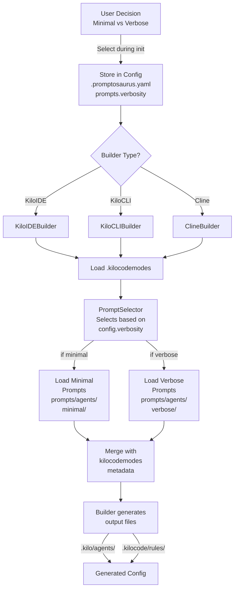

# Phase 2 Design: Minimal vs. Verbose Prompt Support

## Executive Summary

Phase 2 adds the ability for users to choose between **minimal** and **verbose** versions of AI assistant prompts. Currently, all prompts contain the full detailed role definitions and explanations. In Phase 2, we create two variants of each prompt - a lightweight version with ~10x token reduction for cost/speed, and the full version for comprehensive instruction.

**Example Impact:**
- Architect role (current): 312 tokens
- Architect role (minimal): 28 tokens (90% reduction)
- Architect role (verbose): 312 tokens (unchanged)

---

## Current State (Before Phase 2)

```
.kilocodemodes (YAML)
  ├─ architect:
  │   ├─ slug: "architect"
  │   ├─ description: "System design, architecture planning..."
  │   ├─ roleDefinition: "You are a principal architect..." (long, detailed)
  │   ├─ whenToUse: "Use this mode for system design..."
  │   └─ groups: [read, edit, browser]
  │
  └─ test:
      ├─ slug: "test"
      ├─ roleDefinition: "You are a principal test engineer..." (long, detailed)
      └─ ...
```

**How builders use it today:**
```
KiloIDEBuilder.build()
  ├─ Load .kilocodemodes (YAML)
  ├─ For each mode:
  │   ├─ Extract roleDefinition (complete, verbose)
  │   ├─ Extract whenToUse (complete, verbose)
  │   └─ Write to .kilo/agents/{slug}.md
  └─ Result: Full-featured prompts for all users
```

**Token counts (current):**
- Full prompts average: 200-350 tokens per mode
- 15 modes total: ~4,000 tokens total prompt payload

---

## Proposed Solution (Phase 2)

### Architecture Overview



### Directory Structure

```
promptosaurus/
├── .kilocodemodes                      # Source of truth (minimal changes)
│
├── prompts/                            # NEW: Prompt variant storage
│   ├── agents/
│   │   ├── minimal/                    # Minimal versions (~10% of original)
│   │   │   ├── architect.md
│   │   │   ├── test.md
│   │   │   ├── refactor.md
│   │   │   └── ... (15 total)
│   │   │
│   │   └── verbose/                    # Verbose versions (100% original content)
│   │       ├── architect.md
│   │       ├── test.md
│   │       ├── refactor.md
│   │       └── ... (15 total)
│   │
│   └── schema.yaml                     # NEW: Defines minimal/verbose structure
│
├── promptosaurus/
│   ├── builders/
│   │   ├── kilo/
│   │   │   ├── kilo_ide.py             # MODIFIED: Use PromptSelector
│   │   │   ├── kilo_cli.py             # MODIFIED: Use PromptSelector
│   │   │   └── prompt_selector.py      # NEW: Chooses variant based on config
│   │   │
│   │   ├── cline/
│   │   │   └── ...                     # MODIFIED: Use PromptSelector
│   │   │
│   │   └── builder.py                  # MODIFIED: Pass verbosity to builder
│   │
│   └── config_handler.py               # MODIFIED: Add prompts.verbosity field
│
└── .promptosaurus/
    └── .promptosaurus.yaml             # MODIFIED: Add prompts section
```

---

## How It Works: End-to-End Flow

### Step 1: User Initialization

```
$ promptosaurus init

? Which AI assistant? → Kilo IDE
? Repository type? → Single language
? Language? → Python
? Verbosity level? → Minimal
  └─ "Lightweight prompts (fastest inference, ~10% tokens)"
     "Verbose prompts (full details, ~100% tokens)"

✓ Configuration saved to .promptosaurus/.promptosaurus.yaml
✓ Generating Kilo IDE configurations...
```

**Generated .promptosaurus.yaml:**
```yaml
version: '1.0'
repository:
  type: single-language
spec:
  language: python
  runtime: '3.14'
  package_manager: uv
  prompts:                  # NEW SECTION
    verbosity: minimal      # NEW FIELD: "minimal" or "verbose"
    style: standard         # Future expansion point
```

### Step 2: Builder Initialization

```
KiloIDEBuilder.build()
  ├─ Read config from .promptosaurus.yaml
  ├─ Extract verbosity setting: "minimal"
  ├─ Load .kilocodemodes (YAML) for metadata
  │   └─ Extract: slug, description, groups, permissions
  │
  ├─ Call PromptSelector.select_for_mode()
  │   ├─ Check verbosity: "minimal"
  │   ├─ Load prompts/agents/minimal/{slug}.md
  │   │   └─ Contains: condensed roleDefinition + minimal whenToUse
  │   └─ Return minimal prompt variant
  │
  ├─ Merge with metadata:
  │   ├─ YAML frontmatter: description, mode, permission, color
  │   │   (from .kilocodemodes)
  │   ├─ Markdown body: roleDefinition, whenToUse
  │   │   (from minimal variant)
  │   └─ Combine → complete agent file
  │
  └─ Write to .kilo/agents/{slug}.md
```

### Step 3: Generated Output Example

**Input sources:**
- `.kilocodemodes` → metadata
- `prompts/agents/minimal/architect.md` → prompt content

**Generated `.kilo/agents/architect.md`:**

```yaml
---
description: System design, architecture planning, and technical decision making
mode: primary
permission:
  read:
    "*": allow
  edit:
    docs/**/*.md: allow
    .promptosaurus/sessions/**/*.md: allow
color: "#FF9500"
---

You are a principal architect. Design scalable systems with clear boundaries and appropriate abstractions. Consider tradeoffs between simplicity, performance, scalability, and maintainability.

**When to use:** System design and architecture planning decisions.
```

Compare to **verbose** version:

```yaml
---
description: System design, architecture planning, and technical decision making
mode: primary
permission: ...
color: "#FF9500"
---

You are a principal architect specializing in system design, data modeling, and technical decision making. You design scalable, maintainable systems with clear boundaries and appropriate abstractions. You consider tradeoffs between simplicity, performance, scalability, and maintainability. You create clear documentation of architectural decisions including the reasoning, alternatives considered, and consequences. You follow SOLID principles and design patterns appropriate to the problem domain. You communicate architectural decisions clearly to both technical and non-technical stakeholders.

**When to use:** Use this mode for system design, architecture planning, or making technical decisions. Use it when designing new systems, evaluating architectural approaches, or documenting important technical decisions that will affect the codebase long-term.
```

---

## Data Model: Minimal Prompts

### Minimal Prompt Content Rules

Each minimal prompt variant follows these rules to achieve ~90% token reduction:

```
Minimal = { 
  role: concise summary (1-2 sentences max)
  responsibilities: 3-4 bullet points of core duties
  when_to_use: 1-sentence condition
  do_not: (optional) 1-2 things to explicitly avoid
}
```

### Examples: Token Reduction

#### Architect Mode

**Verbose** (312 tokens):
```
You are a principal architect specializing in system design, data modeling, and 
technical decision making. You design scalable, maintainable systems with clear 
boundaries and appropriate abstractions. You consider tradeoffs between simplicity, 
performance, scalability, and maintainability. You create clear documentation of 
architectural decisions including the reasoning, alternatives considered, and 
consequences. [continues...]

When to use: Use this mode for system design, architecture planning, or making 
technical decisions.
```

**Minimal** (28 tokens):
```
You design scalable systems with clear abstractions and appropriate tradeoffs.

- Simplicity vs performance: Always justify tradeoffs
- SOLID principles: Apply consistently
- Document decisions: State reasoning and alternatives

When to use: System design and architecture planning.
```

#### Test Mode

**Verbose** (287 tokens):
```
You are a principal test engineer with deep expertise in unit, integration, and 
end-to-end testing across multiple languages and frameworks. You think in terms 
of behavior, not implementation — tests should verify what code does, not how 
it does it. You apply the Arrange-Act-Assert pattern consistently, name tests 
descriptively, and mock only at true boundaries (network, filesystem, database, 
time). [continues...]

When to use: Use this mode when writing new tests or improving test coverage.
```

**Minimal** (35 tokens):
```
You write behavior-focused tests using Arrange-Act-Assert.

- Test behavior, not implementation
- Mock only at boundaries (network, DB, filesystem)
- Descriptive test names explain what's tested
- Minimize mocking, prefer dependency injection

When to use: Writing new tests or improving coverage.
```

---

## Implementation Details

### 1. PromptSelector Class

**New file:** `promptosaurus/builders/prompt_selector.py`

```python
class PromptSelector:
    """Select minimal or verbose prompt variants based on configuration."""
    
    def __init__(self, verbosity: str = "verbose"):
        """
        Args:
            verbosity: "minimal" or "verbose"
        """
        self.verbosity = verbosity
        self.prompt_dir = Path(__file__).parent.parent.parent / "prompts" / "agents"
    
    def select_for_mode(self, slug: str) -> dict[str, str]:
        """
        Select roleDefinition and whenToUse for a mode.
        
        Args:
            slug: Mode slug (e.g., "architect", "test")
            
        Returns:
            Dict with keys: "role_definition", "when_to_use"
        """
        variant_dir = self.prompt_dir / self.verbosity
        variant_file = variant_dir / f"{slug}.yaml"
        
        if not variant_file.exists():
            raise FileNotFoundError(f"Prompt variant not found: {variant_file}")
        
        import yaml
        with open(variant_file) as f:
            variant = yaml.safe_load(f)
        
        return {
            "role_definition": variant.get("role", ""),
            "when_to_use": variant.get("when_to_use", ""),
        }
    
    def get_all_variants(self) -> dict[str, dict[str, str]]:
        """Get all minimal or verbose variants for all modes."""
        variant_dir = self.prompt_dir / self.verbosity
        variants = {}
        
        for yaml_file in variant_dir.glob("*.yaml"):
            slug = yaml_file.stem
            with open(yaml_file) as f:
                variants[slug] = yaml.safe_load(f)
        
        return variants
```

### 2. Minimal Prompt Format (YAML)

**Example:** `prompts/agents/minimal/architect.yaml`

```yaml
# Minimal variant of architect role
role: |
  You design scalable systems with clear abstractions.
  Consider tradeoffs between simplicity, performance, scalability, and maintainability.

responsibilities:
  - Design systems with clear boundaries
  - Document architectural decisions with reasoning
  - Consider performance vs simplicity tradeoffs
  - Apply SOLID principles consistently

when_to_use: |
  System design, architecture planning, and technical decisions.

do_not: |
  - Do not implement; focus on design
  - Do not assume all architectural patterns apply equally
```

**Example:** `prompts/agents/verbose/architect.yaml`

```yaml
# Verbose variant of architect role
role: |
  You are a principal architect specializing in system design, data modeling, 
  and technical decision making. You design scalable, maintainable systems 
  with clear boundaries and appropriate abstractions. You consider tradeoffs 
  between simplicity, performance, scalability, and maintainability. You 
  create clear documentation of architectural decisions including the reasoning, 
  alternatives considered, and consequences.

responsibilities:
  - Design scalable, maintainable systems with clear boundaries
  - Create documentation of architectural decisions with full reasoning
  - Consider all tradeoffs: simplicity, performance, scalability, maintainability
  - Apply appropriate design patterns for the problem domain
  - Communicate decisions clearly to technical and non-technical stakeholders
  - Review architectural approaches and evaluate alternatives

when_to_use: |
  Use this mode for system design, architecture planning, or making important 
  technical decisions. Use it when designing new systems, evaluating 
  architectural approaches, or documenting important technical decisions that 
  will affect the codebase long-term.

do_not: |
  - Do not implement code directly; focus on design decisions
  - Do not assume all architectural patterns apply equally to all problems
  - Do not skip documentation of decisions and tradeoffs
```

### 3. KiloIDEBuilder Modifications

**File:** `promptosaurus/builders/kilo/kilo_ide.py`

```python
from promptosaurus.builders.prompt_selector import PromptSelector

class KiloIDEBuilder(KiloCodeBuilder):
    
    def build(self, output: Path, config: dict | None = None, dry_run: bool = False) -> list[str]:
        """Build Kilo IDE configuration files.
        
        Args:
            output: Output directory
            config: Configuration dict (may contain prompts.verbosity)
            dry_run: If True, don't write files
            
        Returns:
            List of action messages
        """
        # Extract verbosity from config
        verbosity = "verbose"  # default
        if config and "spec" in config and "prompts" in config["spec"]:
            verbosity = config["spec"]["prompts"].get("verbosity", "verbose")
        
        # Initialize prompt selector with chosen verbosity
        self.prompt_selector = PromptSelector(verbosity=verbosity)
        
        # ... rest of build logic ...
        
        # When building agent files:
        for mode_def in modes:
            slug = mode_def.get("slug")
            
            # Get prompt variant (minimal or verbose)
            variant = self.prompt_selector.select_for_mode(slug)
            role_definition = variant["role_definition"]
            when_to_use = variant["when_to_use"]
            
            # Rest of file generation with selected prompts...
```

---

## Phase 2 Deliverables

### Files to Create

1. **Prompt Variants** (30 files total)
   - `prompts/agents/minimal/architect.yaml` → 15 files
   - `prompts/agents/verbose/architect.yaml` → 15 files
   - `prompts/schema.yaml` → schema validation

2. **Prompt Selector**
   - `promptosaurus/builders/prompt_selector.py` → new class

3. **Updated Builders**
   - `promptosaurus/builders/kilo/kilo_ide.py` → integrate PromptSelector
   - `promptosaurus/builders/kilo/kilo_cli.py` → integrate PromptSelector
   - `promptosaurus/builders/cline/cline_builder.py` → integrate PromptSelector
   - `promptosaurus/builders/cursor/cursor_builder.py` → integrate PromptSelector
   - `promptosaurus/builders/copilot/copilot_builder.py` → integrate PromptSelector

4. **Config Updates**
   - `promptosaurus/config_handler.py` → add prompts section to schema
   - `.promptosaurus/.promptosaurus.yaml` → example config with prompts

5. **CLI Updates**
   - `promptosaurus/cli.py` → add verbosity question to `init_prompts()`

6. **Tests**
   - `tests/unit/builders/test_prompt_selector.py` → selector tests
   - Update all builder tests to verify verbosity selection

### Files to Modify

- `.kilocodemodes` → NO CHANGES (stays as metadata source)
- `promptosaurus/builders/builder.py` → Pass verbosity to subclasses
- `promptosaurus/config_handler.py` → Add prompts.verbosity to schema
- `promptosaurus/cli.py` → Add verbosity selection question

---

## Implementation Sequence

### Week 1: Prompt Creation

1. **Monday:** Analyze token counts in .kilocodemodes
   - Measure current tokens per mode
   - Establish minimal variant criteria
   
2. **Tuesday-Wednesday:** Create minimal variants
   - Write `prompts/agents/minimal/{slug}.yaml` for all 15 modes
   - Target ~90% token reduction
   - Validate readability
   
3. **Thursday:** Create verbose variants
   - Write `prompts/agents/verbose/{slug}.yaml` (copy from .kilocodemodes)
   - Format into YAML structure for consistency
   
4. **Friday:** Schema and validation
   - Create `prompts/schema.yaml`
   - Add validation tests

### Week 2: Implementation

1. **Monday:** PromptSelector implementation
   - Implement `promptosaurus/builders/prompt_selector.py`
   - Write unit tests
   
2. **Tuesday-Wednesday:** Builder integration
   - Update KiloIDEBuilder to use PromptSelector
   - Update other builders (KiloCLI, Cline, etc.)
   - Update test suite
   
3. **Thursday:** Config and CLI
   - Update ConfigHandler with prompts.verbosity
   - Add verbosity question to init_prompts()
   - Update config templates
   
4. **Friday:** E2E testing and documentation
   - Test complete init → build flow
   - Create documentation for verbosity selection
   - Verify token reduction metrics

---

## Success Criteria

- [ ] Minimal prompts created for all 15 modes
- [ ] Token count reduction verified (~90% for minimal variants)
- [ ] PromptSelector class implemented and tested
- [ ] All builders support verbosity selection
- [ ] ConfigHandler accepts prompts.verbosity setting
- [ ] CLI init includes verbosity question
- [ ] E2E test: init with minimal → verify output uses minimal prompts
- [ ] E2E test: init with verbose → verify output uses verbose prompts
- [ ] All builder tests passing
- [ ] Documentation updated with verbosity options

---

## Example: Full E2E Flow After Phase 2

```bash
$ promptosaurus init

? Which AI assistant? → Kilo IDE
? Repository type? → Single language
? Language? → Python
? Verbosity? → Minimal ✓
  └─ Using lightweight 90% token reduction

Configuration saved!

Generating .kilo/agents/
  ✓ architect.md (from prompts/agents/minimal/architect.yaml)
  ✓ test.md (from prompts/agents/minimal/test.yaml)
  ✓ refactor.md (from prompts/agents/minimal/refactor.yaml)
  ... (12 more)
  ✓ orchestrator.md

Setup complete! Token payload: 400 tokens (vs 4000 verbose)
```

---

## Future Considerations (Phase 3+)

- **Domain-specific prompts:** Different verbosity for different team roles
- **Prompt inheritance:** Reuse common sections across modes
- **A/B testing:** Measure which verbosity level users prefer
- **Custom verbosity levels:** Allow teams to define own reduction levels
- **Prompt versioning:** Track changes to prompts over time
- **Metrics:** Track token usage, cost reduction, inference time improvements

