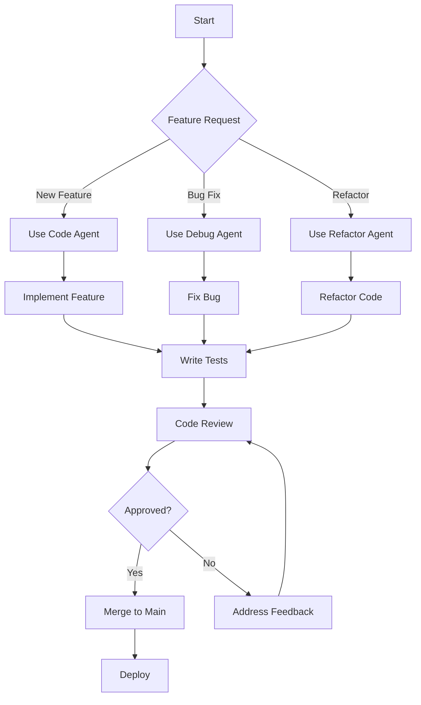

# Common Use Cases

## Role-Based Agent Configuration

### Software Development Teams

#### Backend Software Engineer
```bash
# Initialize configuration and select backend_software_engineer persona
promptosaurus init
# Select: backend_software_engineer persona (includes code, backend agents)
```

#### Frontend Software Engineer
```bash
# Initialize configuration and select frontend_software_engineer persona
promptosaurus init
# Select: frontend_software_engineer persona (includes code, frontend agents)
```

#### DevOps Engineer
```bash
# Initialize configuration and select devops_engineer persona
promptosaurus init
# Select: devops_engineer persona (includes code, devops, observability, incident agents)
```

#### QA/Test Engineer
```bash
# Initialize configuration and select qa_tester persona
promptosaurus init
# Select: qa_tester persona (includes test, review agents)
```

### Project-Specific Configuration

#### New Project Setup
```bash
# Create base configuration for new project
promptosaurus init
# Select: desired AI tool, repo type, variant, and personas interactively

# Verify configuration
promptosaurus validate
```

#### Legacy System Modernization
```bash
# Initialize with architect persona for analysis and planning
promptosaurus init
# Select: architect persona (includes architect, backend, frontend, data agents)

# Switch tools if needed
promptosaurus switch kilo-ide
```

## Tool-Specific Use Cases

### Kilo Code IDE
```bash
# Initialize for Kilo Code IDE
promptosaurus init
# Select "Kilo IDE" when prompted
# Files generated in .kilo/agents/

# Switch to Kilo IDE from another tool
promptosaurus switch kilo-ide
```

### Kilo Code CLI
```bash
# Initialize for Kilo Code CLI
promptosaurus init
# Select "Kilo CLI" when prompted
# Files generated in .opencode/rules/

# Switch to Kilo CLI from another tool
promptosaurus switch kilo-cli
```

### Cline
```bash
# Initialize for Cline
promptosaurus init
# Select "Cline" when prompted
# Single file generated: .clinerules

# Switch to Cline from another tool
promptosaurus switch cline
```

### Claude
```bash
# Initialize for Claude
promptosaurus init
# Select "claude" when prompted
# Files generated in .claude/

# Switch to Claude from another tool
promptosaurus switch claude
```

### GitHub Copilot
```bash
# Initialize for GitHub Copilot
promptosaurus init
# Select "Copilot" when prompted
# File generated: .github/copilot-instructions.md

# Switch to Copilot from another tool
promptosaurus switch copilot
```

## Workflow Automation

### Development Workflow


### CI/CD Integration
```yaml
# .github/workflows/promptosaurus.yml
name: Promptosaurus Configuration
on:
  push:
    branches: [ main ]
  pull_request:
    branches: [ main ]

jobs:
  validate-configurations:
    runs-on: ubuntu-latest
    steps:
    - uses: actions/checkout@v3
    
    - name: Set up Python
      uses: actions/setup-python@v4
      with:
        python-version: '3.11'
    
    - name: Install Promptosaurus
      run: pip install -e .
    
    - name: Validate Configuration
      run: |
        promptosaurus validate
    
    - name: Upload Configuration Artifacts
      uses: actions/upload-artifact@v3
      with:
        name: promptosaurus-config
        path: |
          .kilo/
          .clinerules
          .claude/
          .github/copilot-instructions.md
```

## Troubleshooting Common Issues

### Configuration Not Being Recognized
**Symptoms:** AI tool doesn't recognize generated configuration
**Solutions:**
1. Verify file is in correct location for your tool
2. Check file format matches tool expectations (YAML vs Markdown vs JSON)
3. Ensure file has proper permissions
4. Confirm tool is reloaded/restarted after configuration change
5. Check for syntax errors in generated configuration

### Missing Agents
**Symptoms:** Expected agents not appearing in output
**Solutions:**
1. Verify correct personas were selected during `init` or `swap`
2. Check that the persona exists in the configuration
3. Ensure persona filtering isn't excluding the component
4. Run `promptosaurus swap` to change active personas
5. Run `promptosaurus validate` to check configuration integrity

### Performance Issues
**Symptoms:** Slow generation times
**Solutions:**
1. Use minimal variant for faster generation
2. Limit the number of personas selected
3. Consider switching to a different tool variant

### Persona Filtering Not Working
**Symptoms:** Agents not being filtered correctly by persona
**Solutions:**
1. Verify persona names are spelled correctly (e.g., `qa_tester`, `backend_software_engineer`, `frontend_software_engineer`)
2. Check that personas exist in the configuration
3. Ensure universal agents are working as expected
4. Run `promptosaurus swap` to reselect personas interactively
5. Test with simple persona combinations first

## Best Practices

### For Individual Developers
1. **Start Small:** Begin with just the agents you need for your current task
2. **Use Minimal Variant:** Unless you need detailed comments, use the minimal variant
3. **Leverage Personas:** Use role-based filtering to reduce noise
4. **Keep Updated:** Regularly pull updates to get latest agents and skills

### For Teams
1. **Standardize Configurations:** Commit generated configurations to version control
2. **Validate in CI:** Use `promptosaurus validate` in your CI pipeline
3. **Document Personas:** Record which personas are used for different team roles
4. **Version Control:** Tag configurations with application versions
5. **Share Knowledge:** Document which agents work best for different tasks

### For Advanced Users
1. **Extend IR Models:** Create custom agent models for specialized needs
2. **Build Custom Tools:** Create builders for unsupported AI tools
3. **Modify Templates:** Customize template handlers for specific output formats
4. **Add Personas:** Create new personas for specialized roles in your organization
5. **Optimize Performance:** Implement caching strategies for high-frequency usage
