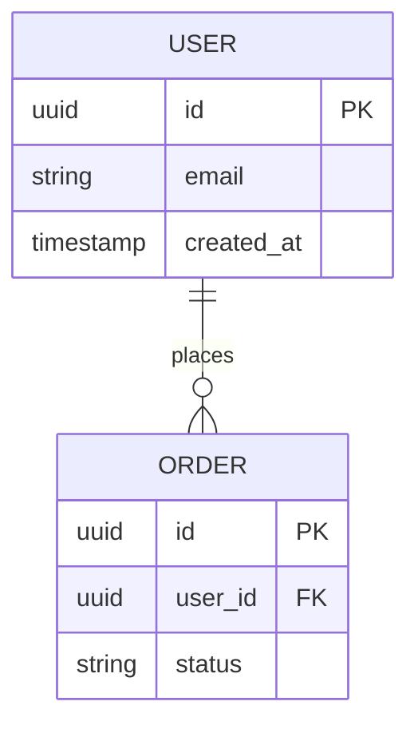

## Data Model Discovery Questions

Before designing any data model, ask these questions:

1. **What are the core entities and their relationships?**
   - Identify nouns in requirements
   - Map relationships (1:1, 1:many, many:many)

2. **What are the most common read patterns?**
   - Which queries will run most frequently?
   - What filters/sorts are needed?

3. **What are the most common write patterns?**
   - Insert frequency and volume
   - Update patterns and triggers

4. **Are there soft-delete, audit trail, or versioning requirements?**
   - Do records need to be recoverable?
   - Is history tracking required?

5. **Any known scale constraints?**
   - Expected row counts
   - Request volume (reads/writes per second)
   - Geographic distribution

### Usage
- Ask all questions before producing designs
- Document answers in design doc
- Use answers to inform indexing and denormalization decisions

---
name: mermaid-erd-creation
description: Create entity relationship diagrams using Mermaid syntax
tools_needed: [write]
---

## Mermaid ERD Format

Use this format for entity relationship diagrams:

### Syntax
- Entity name in UPPERCASE
- Fields inside `{ }` with: type name constraint
- Constraints: PK (primary key), FK (foreign key)
- Relationships: `||--o{` means "one to zero-or-many"
  - `||--||` : one to one
  - `||--o{` : one to zero-or-many
  - `}o--o{` : zero-or-many to zero-or-many

### When to Use
- Include ERD in every data model design
- Update ERD when schema changes
- Use for documentation and stakeholder communication
