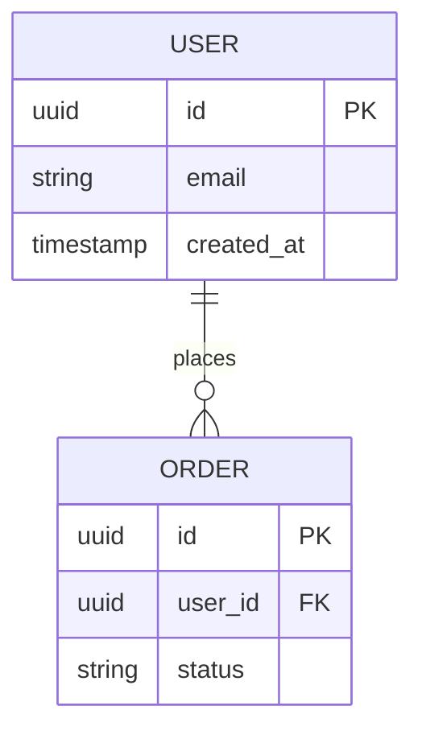

## Mermaid ERD Format

Use this format for entity relationship diagrams:

### Syntax
- Entity name in UPPERCASE
- Fields inside `{ }` with: type name constraint
- Constraints: PK (primary key), FK (foreign key)
- Relationships: `||--o{` means "one to zero-or-many"
  - `||--||` : one to one
  - `||--o{` : one to zero-or-many
  - `}o--o{` : zero-or-many to zero-or-many

### When to Use
- Include ERD in every data model design
- Update ERD when schema changes
- Use for documentation and stakeholder communication
