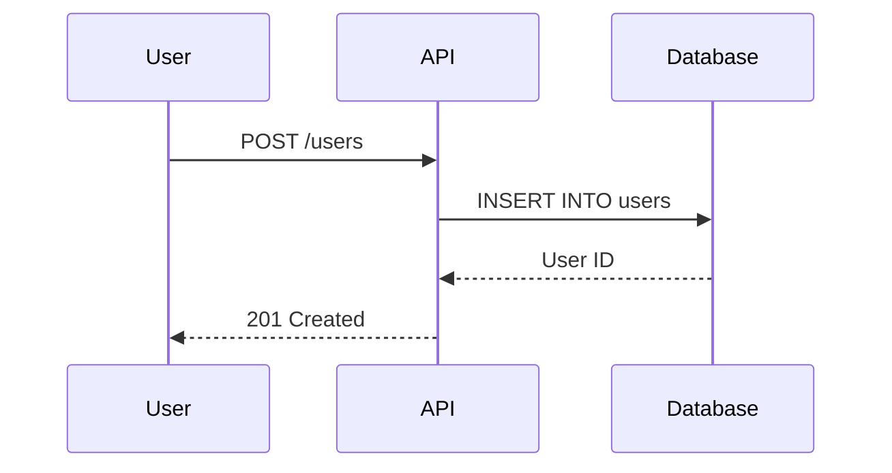
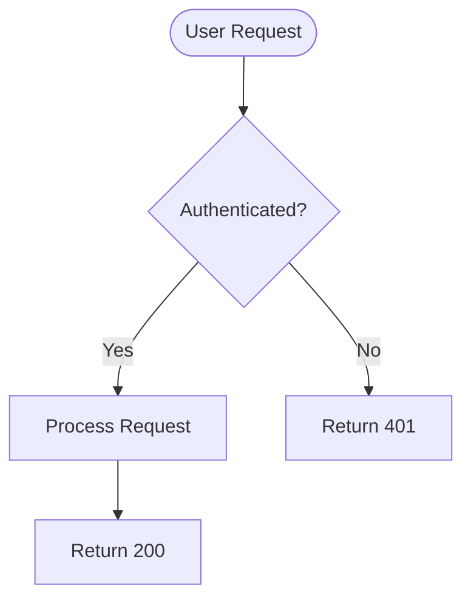
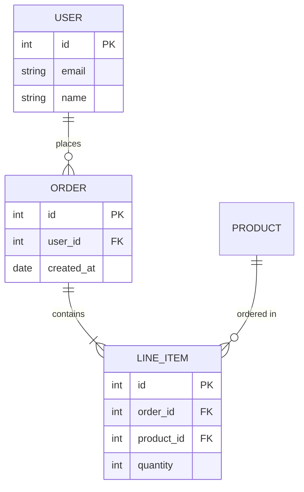
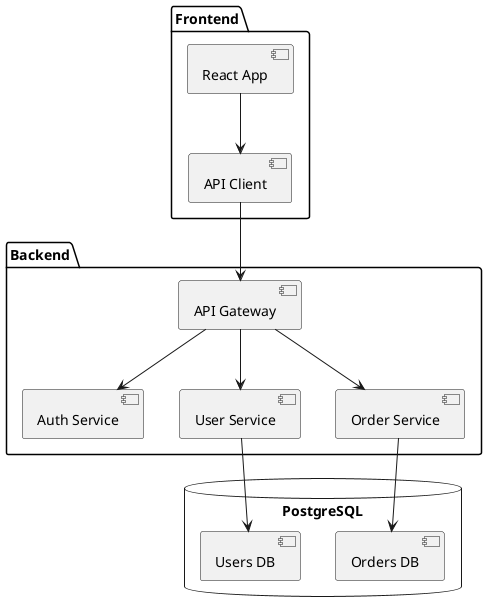

# Documentation Workflow (Verbose)

## Documentation Types

### API Documentation
Complete reference for all public interfaces, functions, classes, and methods.

**Target Audience:** Developers integrating with your code  
**Format:** Structured reference with type signatures, parameters, return values, exceptions  
**Tools:** JSDoc, Javadoc, Sphinx, rustdoc, Godoc, Doxygen

### User Guides
Step-by-step instructions for accomplishing specific tasks.

**Target Audience:** End users and operators  
**Format:** Tutorial-style walkthrough with screenshots  
**Tools:** Markdown, reStructuredText, AsciiDoc

### Tutorials
Learning-oriented content teaching concepts through hands-on examples.

**Target Audience:** New users learning the system  
**Format:** Progressive lessons building on each other  
**Tools:** Jupyter notebooks, interactive documentation platforms

### Troubleshooting Guides
Problem-solution pairs for common errors and issues.

**Target Audience:** Users encountering problems  
**Format:** Symptom → cause → solution structure  
**Tools:** FAQ systems, knowledge bases, Stack Overflow-style Q&A

### Architecture Decision Records (ADRs)
Documentation of significant architectural choices.

**Target Audience:** Engineers and architects  
**Format:** Context, decision, consequences, alternatives considered  
**Tools:** Markdown files in `docs/adr/` directory

### README Files
Project overview, quick start, and essential information.

**Target Audience:** First-time visitors to the repository  
**Format:** Single markdown file with badges, installation, usage  
**Tools:** GitHub/GitLab markdown rendering

---

## Writing for Different Audiences

### End Users (Non-Technical)
**Characteristics:**
- Don't care about implementation details
- Want to accomplish tasks quickly
- Need visual aids and screenshots

**Writing Style:**
- Avoid technical jargon
- Use action-oriented language ("Click the button" not "The button invokes...")
- Include lots of examples
- Provide step-by-step instructions

**Example:**
```markdown
# How to Export Your Data

1. Click the **Settings** icon in the top-right corner
2. Select **Export Data** from the menu
3. Choose your preferred format: CSV or JSON
4. Click **Download** to save the file to your computer

Your data will be downloaded as a file named `export-2026-04-10.csv`.
```

### Developers (Technical)
**Characteristics:**
- Want complete technical details
- Need code examples and API references
- Care about edge cases and error handling

**Writing Style:**
- Use precise technical terminology
- Include type signatures and return values
- Document exceptions and error conditions
- Provide working code examples

**Example:**
```markdown
# DataExporter.export()

Exports user data to specified format.

**Parameters:**
- `format` (string): Output format - `'csv'` or `'json'`
- `user_id` (int): User ID to export data for
- `options` (dict, optional): Additional export options
  - `include_metadata` (bool): Include timestamps and IDs (default: `true`)
  - `date_range` (tuple): Start and end dates (default: all time)

**Returns:**
- `bytes`: Serialized data in specified format

**Raises:**
- `ValueError`: If format is not 'csv' or 'json'
- `UserNotFoundError`: If user_id does not exist
- `PermissionError`: If caller lacks export permission

**Example:**
\```python
from data_exporter import DataExporter

exporter = DataExporter()
csv_data = exporter.export(format='csv', user_id=123)

with open('export.csv', 'wb') as f:
    f.write(csv_data)
\```
```

### Architects (Strategic)
**Characteristics:**
- Care about design decisions and trade-offs
- Need to understand system boundaries and integration points
- Want diagrams showing component relationships

**Writing Style:**
- Focus on "why" not "how"
- Document alternatives considered
- Explain trade-offs and consequences
- Use architecture diagrams

**Example:**
```markdown
# ADR-015: Use PostgreSQL Instead of MongoDB

## Context
We need to store user profiles, orders, and transactions. Current MongoDB 
implementation has become difficult to maintain due to lack of schema enforcement 
and complex aggregation queries.

## Decision
Migrate from MongoDB to PostgreSQL with SQLAlchemy ORM.

## Rationale
- **ACID compliance:** Transactions require strict consistency
- **Relational data:** Orders reference users and products - natural fit for SQL
- **Query complexity:** JOINs are simpler than MongoDB aggregation pipelines
- **Team expertise:** 4 of 5 engineers have PostgreSQL experience

## Consequences

**Positive:**
- Type safety with schema enforcement
- Simpler complex queries
- Better tooling (pgAdmin, query analyzers)

**Negative:**
- Migration requires 2 weeks downtime or complex dual-write
- Lost flexibility of schema-less documents
- Need to learn SQLAlchemy ORM

## Alternatives Considered

**Option 1: Keep MongoDB, add schema validation**
- Pros: No migration needed
- Cons: Doesn't solve complex query problem

**Option 2: Use both (polyglot persistence)**
- Pros: Best tool for each job
- Cons: Operational complexity, data sync issues
```

---

## Markdown Best Practices

### Headings
Use ATX-style headings with blank lines before and after.

```markdown
## Good Example

Content here.

## Another Section

More content.
```

### Code Blocks
Always specify language for syntax highlighting.

```markdown
\```python
def hello():
    print("Hello, world!")
\```

\```javascript
function hello() {
  console.log("Hello, world!");
}
\```
```

### Links
Use reference-style links for readability.

```markdown
See the [installation guide][install] for setup instructions.
Check the [API reference][api] for detailed documentation.

[install]: docs/installation.md
[api]: docs/api.md
```

### Lists
Use consistent indentation (2 or 4 spaces).

```markdown
- Top-level item
  - Nested item
  - Another nested item
- Second top-level item
```

### Tables
Use proper alignment and spacing.

```markdown
| Name       | Type   | Required | Description          |
|------------|--------|----------|----------------------|
| user_id    | int    | Yes      | Unique user ID       |
| email      | string | Yes      | User email address   |
| created_at | date   | No       | Account creation date|
```

### Admonitions
Use blockquotes or custom notation for warnings and tips.

```markdown
> **Warning:** This operation is irreversible. Back up your data first.

> **Note:** This feature requires version 2.0 or higher.

> **Tip:** Use the `--verbose` flag to see detailed output.
```

---

## Code Example Best Practices

### Make Examples Runnable
Every code example should be complete and executable.

❌ **Bad (Fragment):**
```python
user = get_user(user_id)
print(user.name)
```

✓ **Good (Complete):**
```python
from myapp import get_user

# Fetch user by ID
user = get_user(user_id=123)

# Print user's name
print(user.name)  # Output: "Alice Johnson"
```

### Show Expected Output
Always include what the code will produce.

```python
>>> from calculator import add
>>> result = add(5, 3)
>>> print(result)
8
```

### Test Examples in CI
Use doctests or example tests to ensure examples stay current.

```python
# Python doctest
def add(a, b):
    """
    Add two numbers.
    
    >>> add(2, 3)
    5
    >>> add(-1, 1)
    0
    """
    return a + b

# Run: python -m doctest mymodule.py
```

### Handle Errors Gracefully
Show error handling in examples.

```python
from myapp import get_user, UserNotFoundError

try:
    user = get_user(user_id=999)
except UserNotFoundError:
    print("User not found. Please check the ID and try again.")
```

---

## Docstring Standards

### Python (Google Style)
```python
def calculate_total(items: list[dict], tax_rate: float = 0.08) -> float:
    """Calculate total price including tax.
    
    Args:
        items: List of items with 'price' and 'quantity' keys
        tax_rate: Tax rate as decimal (default: 0.08 for 8%)
    
    Returns:
        Total price including tax
    
    Raises:
        ValueError: If any item has negative price or quantity
    
    Example:
        >>> items = [{'price': 10.00, 'quantity': 2}, {'price': 5.00, 'quantity': 1}]
        >>> calculate_total(items)
        27.0
    """
    subtotal = sum(item['price'] * item['quantity'] for item in items)
    return subtotal * (1 + tax_rate)
```

### TypeScript (JSDoc)
```typescript
/**
 * Calculate total price including tax.
 * 
 * @param items - Array of items with price and quantity
 * @param taxRate - Tax rate as decimal (default: 0.08)
 * @returns Total price including tax
 * @throws {ValueError} If any item has negative price or quantity
 * 
 * @example
 * ```typescript
 * const items = [{price: 10.00, quantity: 2}, {price: 5.00, quantity: 1}];
 * const total = calculateTotal(items);
 * console.log(total); // 27.0
 * ```
 */
function calculateTotal(
  items: Array<{price: number, quantity: number}>,
  taxRate: number = 0.08
): number {
  const subtotal = items.reduce((sum, item) => sum + item.price * item.quantity, 0);
  return subtotal * (1 + taxRate);
}
```

### Java (Javadoc)
```java
/**
 * Calculate total price including tax.
 * 
 * @param items List of items with price and quantity
 * @param taxRate Tax rate as decimal (default: 0.08)
 * @return Total price including tax
 * @throws IllegalArgumentException if any item has negative price or quantity
 * 
 * <pre>{@code
 * List<Item> items = Arrays.asList(
 *     new Item(10.00, 2),
 *     new Item(5.00, 1)
 * );
 * double total = calculateTotal(items, 0.08);
 * System.out.println(total); // 27.0
 * }</pre>
 */
public double calculateTotal(List<Item> items, double taxRate) {
    double subtotal = items.stream()
        .mapToDouble(item -> item.getPrice() * item.getQuantity())
        .sum();
    return subtotal * (1 + taxRate);
}
```

### Go (Godoc)
```go
// CalculateTotal computes the total price including tax.
//
// items is a slice of items with Price and Quantity fields.
// taxRate is the tax rate as a decimal (e.g., 0.08 for 8%).
//
// Returns the total price including tax.
//
// Example:
//
//	items := []Item{
//	    {Price: 10.00, Quantity: 2},
//	    {Price: 5.00, Quantity: 1},
//	}
//	total := CalculateTotal(items, 0.08)
//	fmt.Println(total) // Output: 27.0
func CalculateTotal(items []Item, taxRate float64) float64 {
    subtotal := 0.0
    for _, item := range items {
        subtotal += item.Price * float64(item.Quantity)
    }
    return subtotal * (1 + taxRate)
}
```

---

## Diagrams and Visual Documentation

### Mermaid Diagrams
Embed diagrams directly in markdown using Mermaid syntax.

**Sequence Diagram:**


**Flowchart:**


**Entity Relationship Diagram:**


### PlantUML Diagrams
Use PlantUML for complex architecture diagrams.

**Component Diagram:**


---

## API Documentation Tools

### OpenAPI / Swagger (REST APIs)
```yaml
openapi: 3.0.0
info:
  title: User API
  version: 1.0.0

paths:
  /users:
    get:
      summary: List all users
      parameters:
        - name: limit
          in: query
          schema:
            type: integer
            default: 10
        - name: offset
          in: query
          schema:
            type: integer
            default: 0
      responses:
        '200':
          description: Successful response
          content:
            application/json:
              schema:
                type: object
                properties:
                  users:
                    type: array
                    items:
                      $ref: '#/components/schemas/User'
                  total:
                    type: integer

components:
  schemas:
    User:
      type: object
      required:
        - id
        - email
      properties:
        id:
          type: integer
        email:
          type: string
        name:
          type: string
```

### GraphQL Schema Documentation
```graphql
"""
User account in the system
"""
type User {
  """
  Unique user identifier
  """
  id: ID!
  
  """
  User's email address (must be unique)
  """
  email: String!
  
  """
  User's display name
  """
  name: String
  
  """
  Orders placed by this user
  """
  orders(limit: Int = 10, offset: Int = 0): [Order!]!
}

type Query {
  """
  Fetch a user by ID
  
  Returns null if user not found
  """
  user(id: ID!): User
  
  """
  List all users with pagination
  """
  users(limit: Int = 10, offset: Int = 0): [User!]!
}
```

---

## README Structure Template

```markdown
# Project Name

[](https://ci.example.com)
[](https://codecov.io)
[](LICENSE)

One-sentence description of what this project does.

## Features

- Feature 1: Brief description
- Feature 2: Brief description
- Feature 3: Brief description

## Installation

### Prerequisites

- Python 3.11+
- PostgreSQL 14+
- Redis 7+

### Install from PyPI

\```bash
pip install project-name
\```

### Install from Source

\```bash
git clone https://github.com/username/project-name.git
cd project-name
pip install -e .
\```

## Quick Start

\```python
from project_name import Client

# Initialize client
client = Client(api_key="your-api-key")

# Fetch user
user = client.get_user(user_id=123)
print(user.name)
\```

## Documentation

Full documentation available at [https://docs.example.com](https://docs.example.com)

- [Installation Guide](docs/installation.md)
- [API Reference](docs/api.md)
- [Tutorials](docs/tutorials.md)
- [Troubleshooting](docs/troubleshooting.md)

## Configuration

Create a `.env` file:

\```bash
DATABASE_URL=postgresql://localhost/mydb
REDIS_URL=redis://localhost:6379
API_KEY=your-secret-key
\```

## Development

### Setup Development Environment

\```bash
# Clone repository
git clone https://github.com/username/project-name.git
cd project-name

# Install dependencies
pip install -e ".[dev]"

# Run tests
pytest

# Run linter
ruff check .
\```

### Running Tests

\```bash
# All tests
pytest

# With coverage
pytest --cov=project_name --cov-report=html

# Specific test file
pytest tests/test_client.py
\```

## Contributing

See [CONTRIBUTING.md](CONTRIBUTING.md) for development guidelines.

## License

This project is licensed under the MIT License - see [LICENSE](LICENSE) file for details.

## Support

- [Documentation](https://docs.example.com)
- [Issue Tracker](https://github.com/username/project-name/issues)
- [Discussions](https://github.com/username/project-name/discussions)
- Email: support@example.com
```

---

## Common Documentation Mistakes

### Mistake 1: Outdated Examples
**Problem:** Code examples don't work with current version.

**Solution:**
- Add CI job that runs all examples
- Use doctest to verify examples automatically
- Include version number in examples: `# Requires v2.0+`

### Mistake 2: Missing Prerequisites
**Problem:** Instructions assume knowledge or tools not mentioned.

**Solution:**
```markdown
## Prerequisites

Before starting, ensure you have:

- [ ] Python 3.11 or higher installed (`python --version`)
- [ ] PostgreSQL 14+ running locally (`psql --version`)
- [ ] Git installed (`git --version`)
- [ ] An API key from [https://example.com/keys](https://example.com/keys)
```

### Mistake 3: No Error Handling Examples
**Problem:** Only show happy path, not how to handle errors.

**Solution:**
```python
# Good: Show error handling
try:
    user = client.get_user(user_id=123)
except UserNotFoundError:
    print("User 123 not found")
except APIError as e:
    print(f"API error: {e.message}")
```

### Mistake 4: Vague Descriptions
**Problem:** "Returns a value" - what value? What type?

**Solution:**
```markdown
**Returns:**
- `User` object with fields:
  - `id` (int): User ID
  - `email` (str): Email address
  - `created_at` (datetime): Account creation timestamp
```

### Mistake 5: No Troubleshooting Section
**Problem:** Users hit common errors with no guidance.

**Solution:**
```markdown
## Troubleshooting

### Error: "Connection refused"

**Cause:** Database is not running or wrong connection URL.

**Solution:**
1. Verify PostgreSQL is running: `pg_isready`
2. Check connection URL in `.env` file
3. Ensure database exists: `psql -l`

### Error: "Invalid API key"

**Cause:** API key is missing, incorrect, or expired.

**Solution:**
1. Check `.env` file has `API_KEY=...`
2. Verify key at [https://example.com/keys](https://example.com/keys)
3. Regenerate key if expired
```

### Mistake 6: No Version Information
**Problem:** Documentation doesn't specify which version it applies to.

**Solution:**
```markdown
> **Note:** This documentation is for version 2.0. 
> For version 1.x docs, see [v1 branch](https://github.com/user/repo/tree/v1).
```

### Mistake 7: Unclear Scope
**Problem:** Readers don't know if documentation applies to them.

**Solution:**
```markdown
# User Guide

**For:** End users of the web application  
**Assumes:** No programming knowledge  
**Time to complete:** 15 minutes

# API Reference

**For:** Developers integrating with the API  
**Assumes:** Familiarity with REST APIs and JSON  
**Time to complete:** 1 hour
```

### Mistake 8: No Context in Code Examples
**Problem:** Code snippet without explanation of what it does or why.

**Solution:**
```python
# BAD: No context
user = db.query(User).filter(User.email == email).first()

# GOOD: Explain why
# Fetch user by email (case-sensitive)
# Returns None if user not found, allowing us to distinguish
# between "user exists" and "user not found" cases
user = db.query(User).filter(User.email == email).first()
if user is None:
    raise UserNotFoundError(f"No user with email {email}")
```

### Mistake 9: Broken Links
**Problem:** Links to external sites or internal docs are dead.

**Solution:**
```bash
# Install link checker
npm install -g markdown-link-check

# Check all markdown files
find . -name "*.md" -exec markdown-link-check {} \;

# Add to CI
- name: Check links
  run: |
    npm install -g markdown-link-check
    markdown-link-check docs/**/*.md
```

---

## Documentation Tools

### Static Site Generators

**Sphinx (Python):**
```bash
# Install
pip install sphinx sphinx-rtd-theme

# Initialize
sphinx-quickstart docs

# Build
cd docs
make html
```

**MkDocs (Markdown):**
```bash
# Install
pip install mkdocs mkdocs-material

# Initialize
mkdocs new my-project
cd my-project

# Serve locally
mkdocs serve

# Build
mkdocs build
```

**Docusaurus (React):**
```bash
# Install
npx create-docusaurus@latest my-docs classic

# Start dev server
cd my-docs
npm start

# Build
npm run build
```

**GitBook:**
```bash
# Install
npm install -g gitbook-cli

# Initialize
gitbook init

# Serve
gitbook serve

# Build
gitbook build
```

---

## Publishing and Hosting

### GitHub Pages
```bash
# Build docs
mkdocs build

# Deploy to gh-pages branch
mkdocs gh-deploy
```

### Read the Docs
```yaml
# .readthedocs.yaml
version: 2

build:
  os: ubuntu-22.04
  tools:
    python: "3.11"

sphinx:
  configuration: docs/conf.py

python:
  install:
    - requirements: docs/requirements.txt
```

### Netlify
```toml
# netlify.toml
[build]
  command = "mkdocs build"
  publish = "site"
```

---

## Keeping Docs Synchronized with Code

### Strategy 1: Docs as Code
- Store docs in same repository as code
- Require docs updates in same PR as code changes
- Use CI to verify docs build successfully

### Strategy 2: Automated API Docs
```python
# Generate API docs from docstrings
# Python: Sphinx autodoc
# TypeScript: TypeDoc
# Java: Javadoc
# Go: godoc

# Example: Sphinx autodoc
# docs/conf.py
extensions = ['sphinx.ext.autodoc']

# docs/api.rst
.. automodule:: myproject.users
   :members:
```

### Strategy 3: Example Testing
```python
# Test that examples in docs actually work
import doctest

def test_examples():
    """Run all doctests in documentation."""
    doctest.testfile("docs/tutorial.md")
    doctest.testfile("docs/api.md")
```

### Strategy 4: Version Docs with Releases
```bash
# Tag release
git tag v2.0.0

# Build docs for this version
mkdocs build

# Deploy with version prefix
mv site docs-site/v2.0.0
```
